**Lavorare con i TAG (master di account)**
##########################################

I Tags fungono da riferimento per i progetti, e vengono assegnati alle risorse cloud istanziate nell’account.

Per assegnare i Tag alle sue risorse di un account (come VM, DBAAS, volumi e share) è necessario essere accreditati come Master di Account e 
utilizzare la relativa interfaccia.

|

|

**Associazione Tag ad una Risorsa specifica**
*********************************************

Nel caso in cui si volesse associare un Tag ad una risorsa specifica, bisognerà innanzitutto raggiungere la risorsa desiderata

Se la risorsa desiderata dovesse essere una **VM**, la lista delle VM si trova sotto
“Servizi” --> “Compute” --> “VM”

Se la risorsa desiderata dovesse essere un **Volume**, la lista dei Volumi si trova sotto
“Servizi” --> “Compute” --> “Volumi”

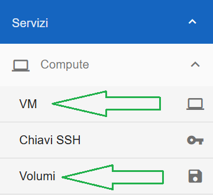

|

Se la risorsa desiderata dovesse essere un **DBAAS**, la lista dei DBAAS si trova sotto
“Servizi” --> “Database” --> “Istanze DBAAS”

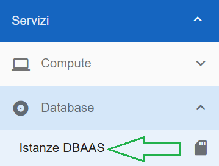

|

Se la risorsa desiderata dovesse essere una Share, la lista delle Shares si trova sotto
“Servizi” --> “Storage” --> “Shares”

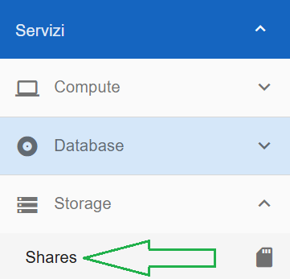

|

La voce VM, ad esempio, porterà alla lista di tutte le VM dell’account.

Per associare un Tag ad una risorsa specifica, bisognerà selezionare la risorsa desiderata e cliccare sul pulsante “Pannello gestione VM”
(ogni tipo di risorsa avrà il suo Pannello di gestione, in questo caso VM)

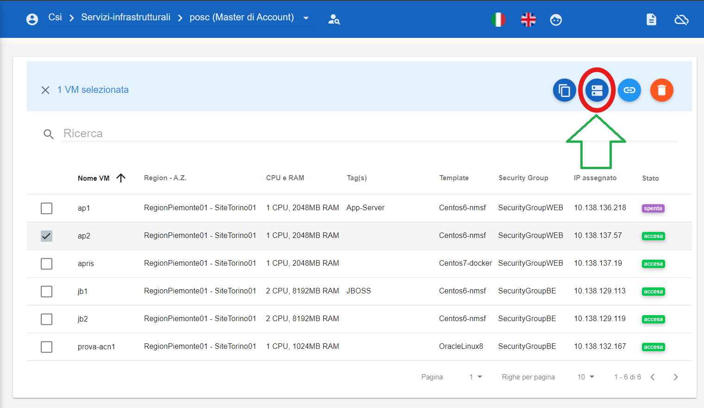

|

Verrà quindi mostrata la schermata di gestione dove saranno presenti tutte le caratteristiche della risorsa, tra cui anche gli eventuali Tags già presenti

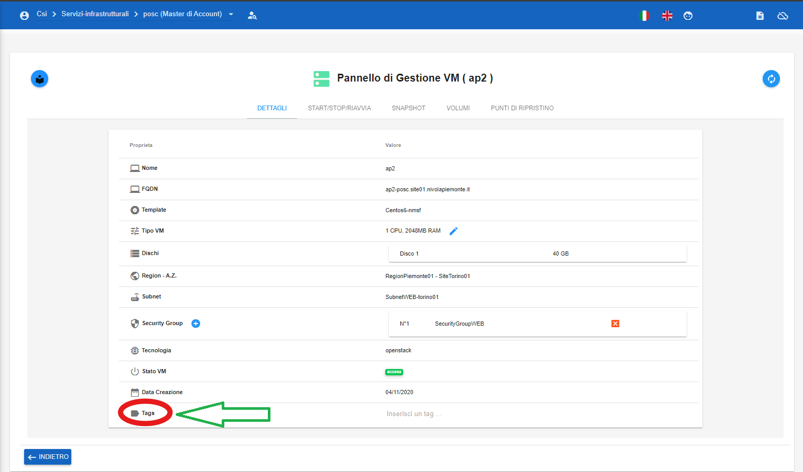

|

Per aggiungere il Tag bisognerà semplicemente digitare la stringa alfanumerica desiderata

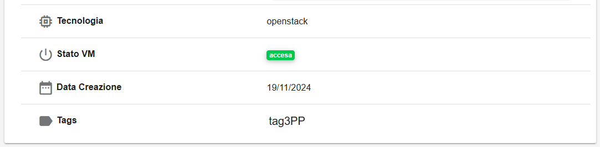

Quindi premere **INVIO**. 
Il tag appena creato apparirà di colore grigio

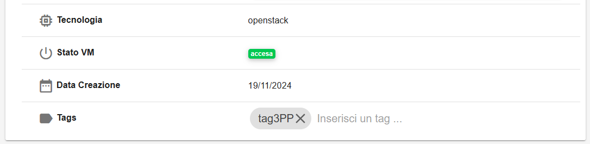

A conferma dell'associazione del Tag alla risorsa, comparirà il seguente messaggio

|

|

**Eliminare Tag da una Risorsa specifica**
******************************************

Se si desidera eliminare un Tag da una risorsa specifica, basterà selezionare la risorsa, andare nel suo pannello di gestione e cliccare 
sulla **X** del codice da eliminare

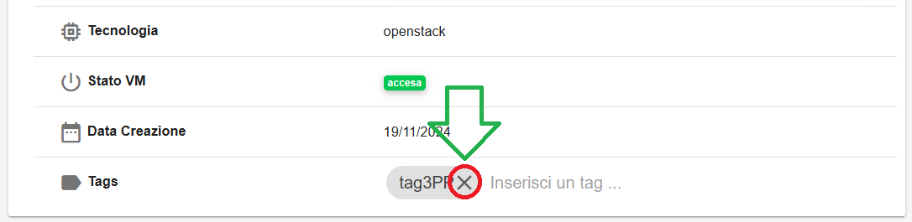

Comparirà il seguente messaggio di conferma finale

|

|

**Report per Tag**
******************

In questa sezione della guida verrà spiegato come generare i report filtrandoli per Tag e per mese.

La funzione rientra nel menù **Gestione account**. La generazione dei report filtrati per Tag e mese è attivabile dalla parte sinistra dello schermo, 
cliccando sulla label **Report**

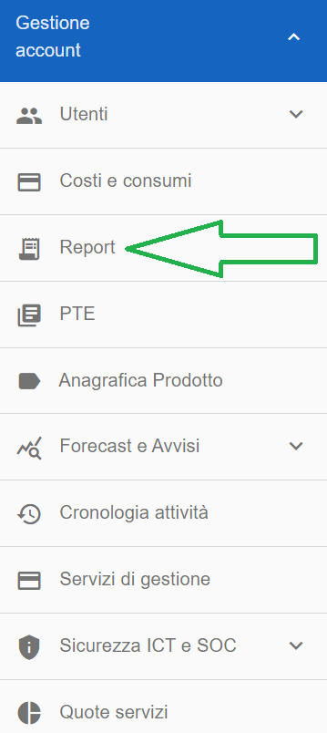

A seguito di un click su **Report**, il sistema permetterà di accedere alle pagina **Lista Report**

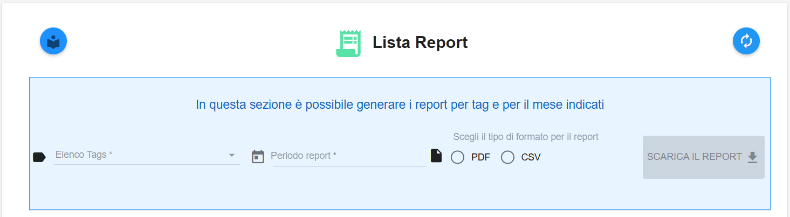

All'interno della prima sezione occorre:

- impostare uno o più tag dal primo campo denominato "Elenco Tags". Per far comparire la lista dei tag associati alle risorse dell'account è sufficiente cliccare in un punto qualsiasi di tale campo

.. image:: img/24.5_tag102.png

- impostare il mese dal secondo campo denominato "Periodo report". Per far comparire la lista dei mesi cliccare sull'icona sulla sinistra a forma di calendario

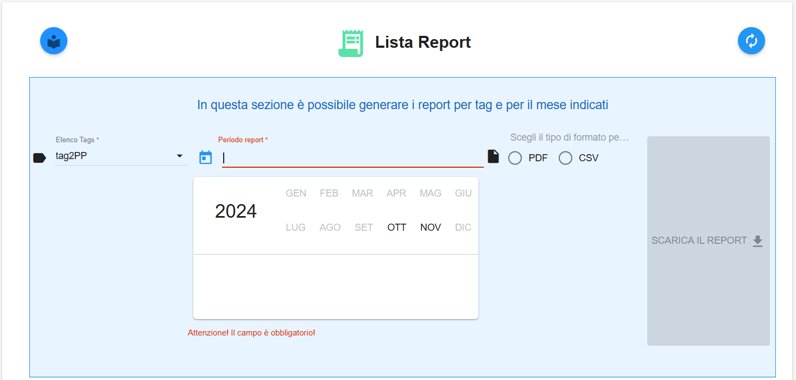

- dall'ultimo campo, impostare **PDF** oppure **CSV**

- cliccare su **SCARICA IL REPORT** per effettuare il download in locale del report

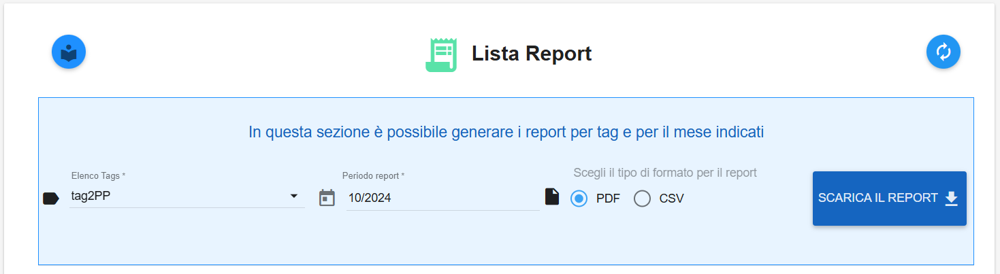

Tale report conterrà i costi delle risorse (VM, DBAAS, volumi, share) che risultavano associati al/ai tag impostati e in relazione al mese selezionato.
