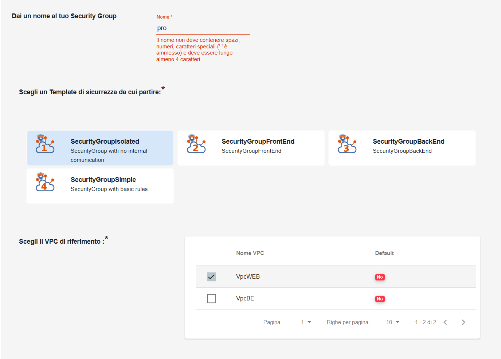

.. _Creare_Security_Group:

**Creare un Security Group**
****************************

La funzione rientra nel menù **Servizi**. La **Creazione di un Security Group** 
è attivabile dalla parte sinistra dello schermo, 
cliccando sulla label **Security Group** sotto **Reti e Sicurezza**

.. image:: img/SG_innesco.png

A seguito di un clic su **Security Group**, il sistema,
esporrà l'**Elenco dei Security Group** nella parte centrale
dello schermo.

.. image:: img/SG_elenco.png

|

Per creare un nuovo Security Group, procedere seguendo i seguenti passaggi:

1. Fare clic sul pulsante **"+"**:

.. image:: img/Add_VM.png

|

2. Specificare i parametri necessari al sistema:

•	inserire **Nome del Security Group** nella textbox, rispettando la regola per la quale il nome non deve contenere spazi, numeri e caratteri speciali (**“-”** escluso) e deve essere superiore ai 4 caratteri
•	optare per un :ref:`Template di Sicurezza<Template_Sicurezza>` selezionandolo tra quelli proposti
•	indicare il **VPC di riferimento** evidenziandolo dalla checkbox

|

3. Terminare premendo su **CREA SECURITY GROUP**

