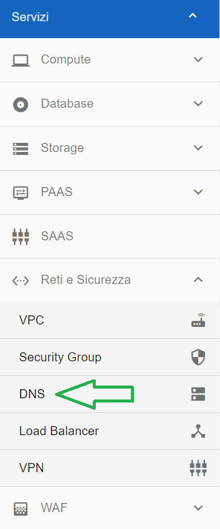
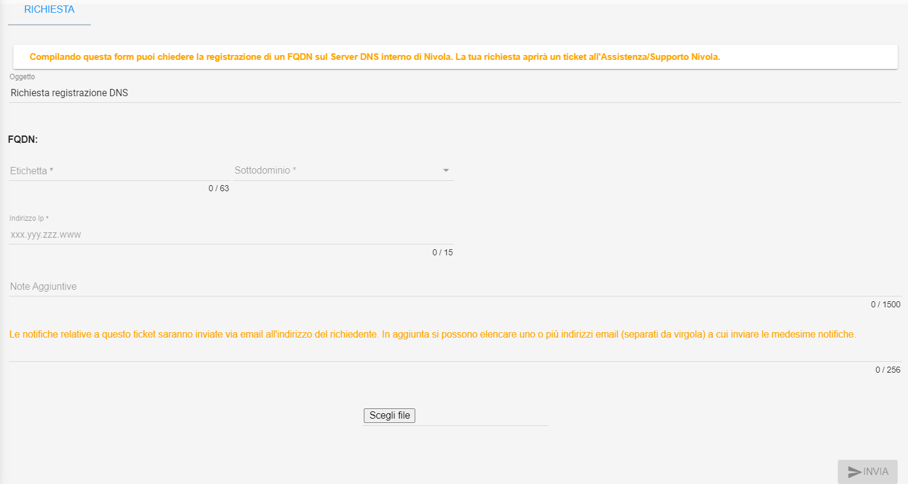

**Domain Name System (DNS)**
****************************

La richiesta di registrazione di un record sui server DNS interni a Nivola si basa su 2 informazioni:

• FQDN da registrare : deve essere un FQDN ristretto ai sottodomini

site01.nivolapiemonte.it

site02.nivolapiemonte.it

site03.nivolapiemonte.it

site05.nivolapiemonte.it

site06.nivolapiemonte.it

Quindi valgono le richieste come ad esempio pippo.site05.nivolapiemonte.it.
Ogni etichetta deve essere composta da 1 a 63 caratteri e la lunghezza massima consentita per l’FQDN nel suo complesso è di 255 caratteri. 
Si possono usare numeri, lettere e il carattere “-” .

• IP che risolve la richiesta : xxx.yyy.zzz.www

(regole degli IPv4 , ovvero 4 numeri compresi tra 0 e 255 separati dal punto)

|

La funzione è attivabile attraverso il ruolo **Master di account**.
Occorre accedere alla funzionalità **DNS**, attivabile dalla parte sinistra dello schermo, all'interno del menù **Reti e Sicurezza**

Dalla schermata che appare, compilare i dati richiesti:

Una volta compilati i campi richiesti, cliccare su **INVIA**

.. image:: img/15.4_DNSDXok.png

Comparirà il seguente messaggio a conferma della corretta apertura del ticket

