**Web Application Firewall (WAF)**
**********************************

I Web Application Firewall (WAF) consentono di proteggere le applicazioni Web da attacchi dannosi e traffico Internet indesiderato, 
inclusi bot, injection e denial of service (DoS) a livello di applicazione. WAF consentirà di definire e gestire le regole per evitare 
minacce e le vulnerabilità definite da OWASP. Il firewall dell'applicazione Web viene distribuito per proteggere le applicazioni e aiuta 
a proteggere le applicazioni distribuite nel cloud pubblico. Le WAF possono identificare e bloccare il traffico bot dannoso con un set 
avanzato di metodi di verifica.

**WAF - Richiesta inserimento Certificato e Chiave privata**
************************************************************

La funzione è attivabile attraverso il ruolo **Master di account**.
Occorre accedere alla funzionalità **Certificati su WAF**, attivabile dalla parte sinistra dello schermo, all'interno del menù **WAF**, a sua volta 
contenuto all'interno del menù **Reti e Sicurezza**

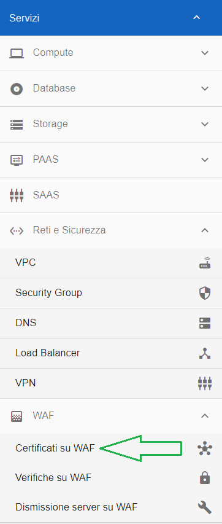

Dalla schermata **Richiesta inserimento Certificato e Chiave privata** che appare, compilare i dati richiesti:

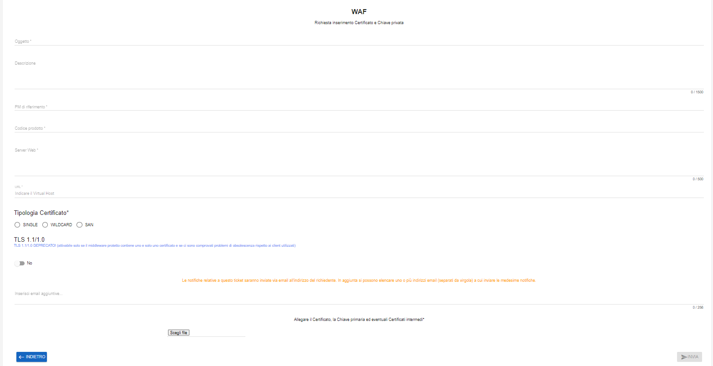

Una volta compilati i campi richiesti, cliccare su **INVIA**

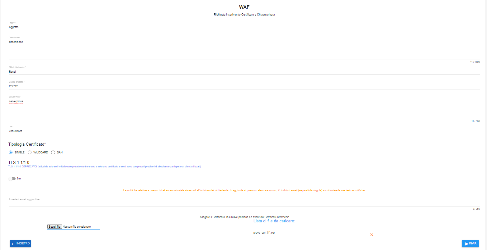

Comparirà il seguente messaggio a conferma della corretta apertura del ticket

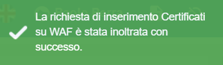

|

**WAF - Richiesta verifica falsi positivi**
*******************************************

La funzione è attivabile attraverso il ruolo **Master di account**.
Occorre accedere alla funzionalità **Verifiche su WAF**, attivabile dalla parte sinistra dello schermo, all'interno del menù **WAF**, a sua volta 
contenuto all'interno del menù **Reti e Sicurezza**

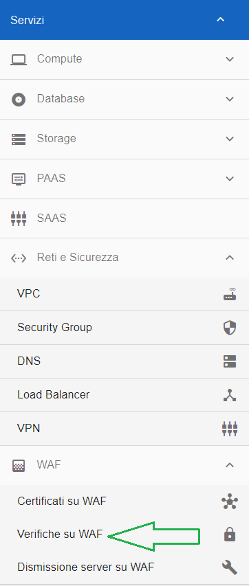

Dalla schermata **Richiesta verifica falsi positivi** che appare, compilare i dati richiesti:

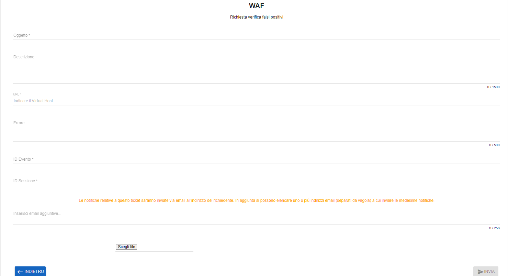

Una volta compilati i campi richiesti, cliccare su **INVIA**

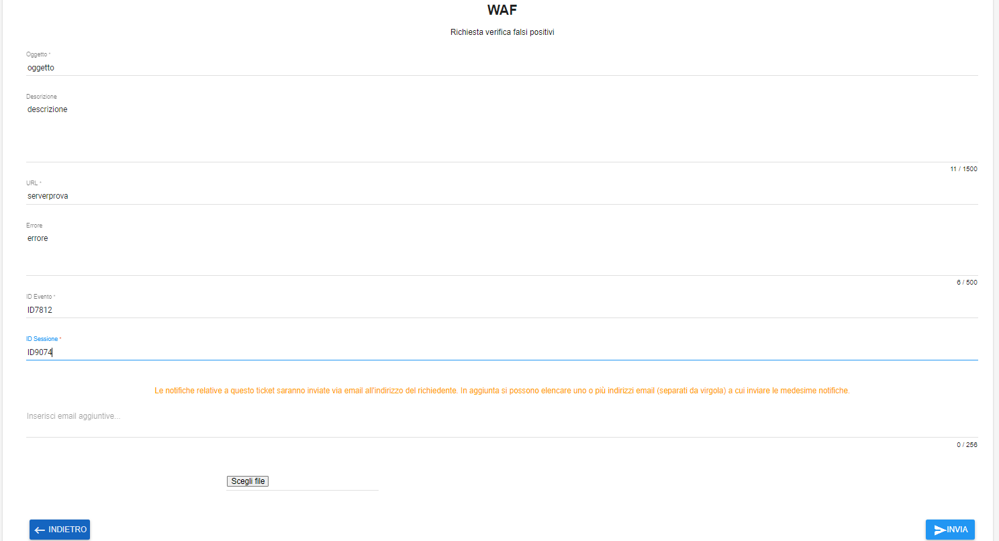

Comparirà il seguente messaggio a conferma della corretta apertura del ticket

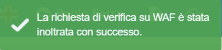

|

**WAF - Richiesta dismissione server**
**************************************

La funzione è attivabile attraverso il ruolo **Master di account**.
Occorre accedere alla funzionalità **Dismissione server su WAF**, attivabile dalla parte sinistra dello schermo, all'interno del menù **WAF**, a sua volta 
contenuto all'interno del menù **Reti e Sicurezza**

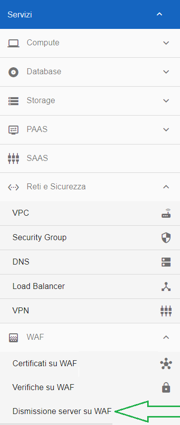

Dalla schermata **Richiesta dismissione server** che appare, compilare i dati richiesti:

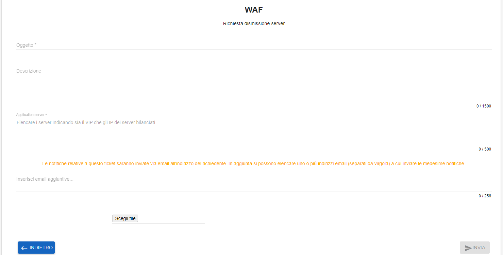

Una volta compilati i campi richiesti, cliccare su **INVIA**

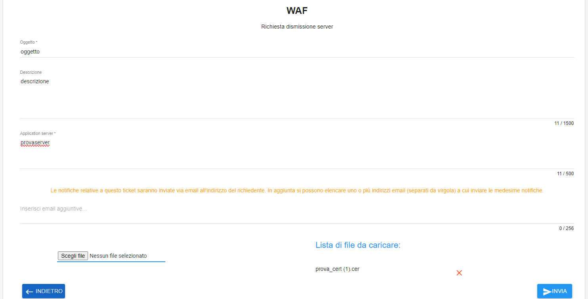

Comparirà il seguente messaggio a conferma della corretta apertura del ticket relativo al WAF

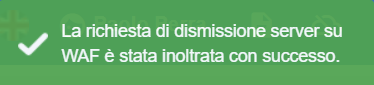
