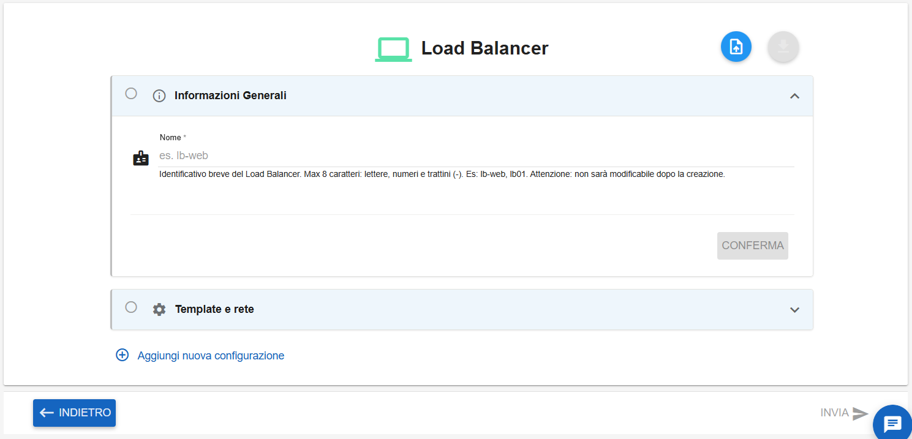
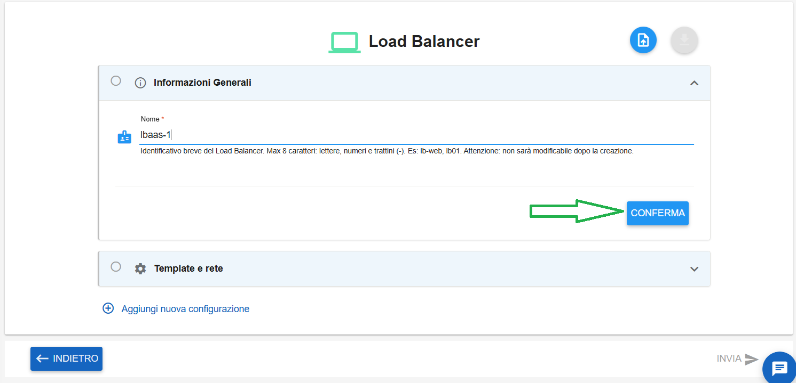
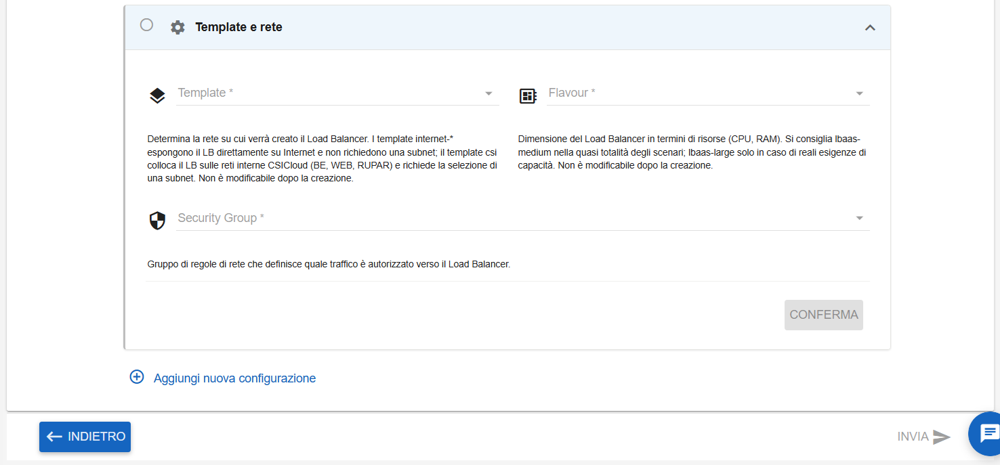
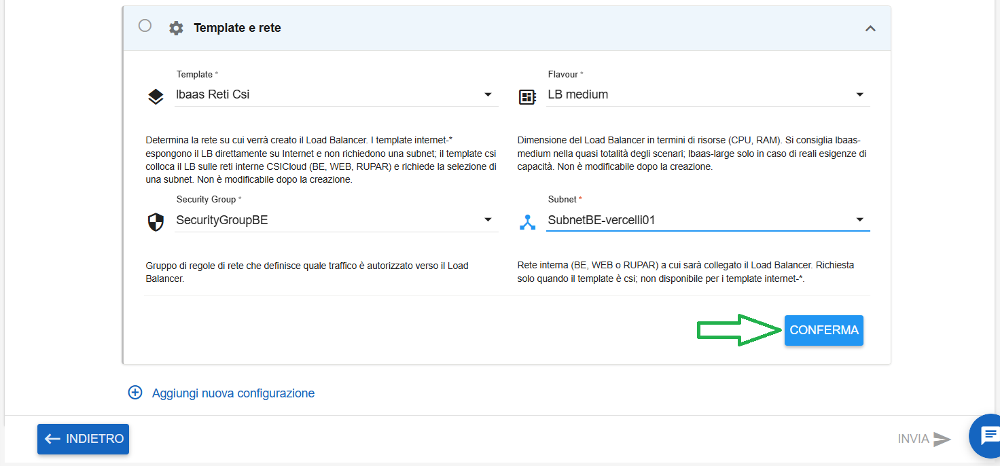
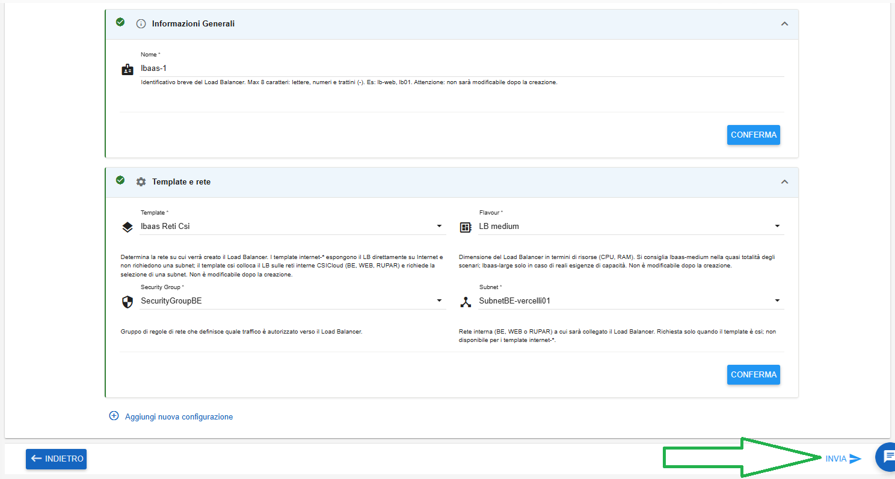
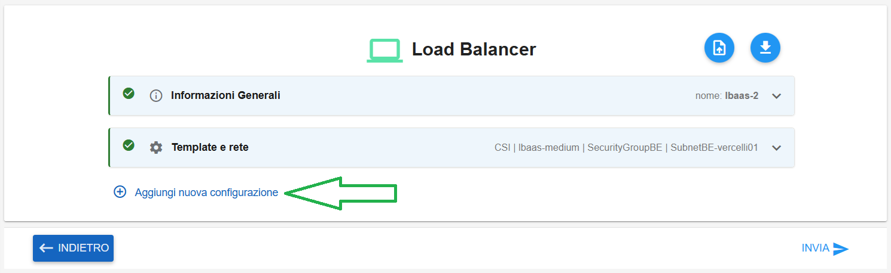
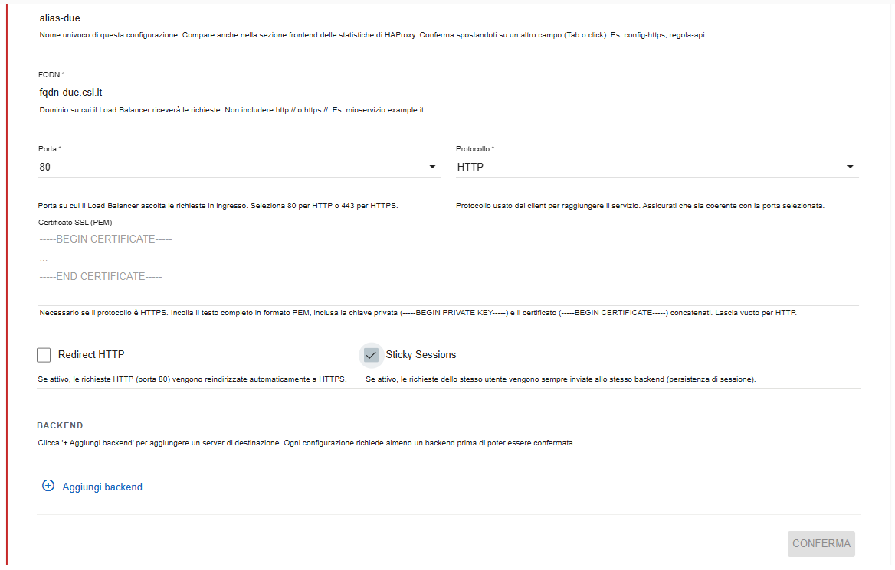
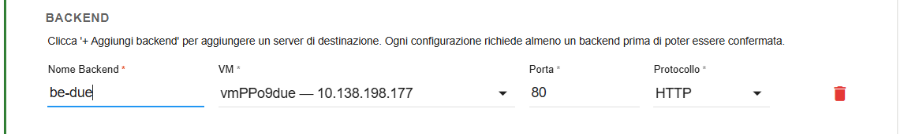
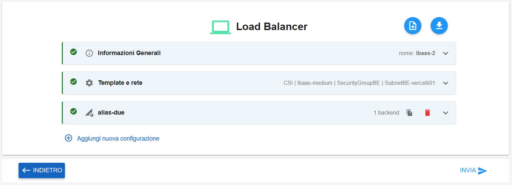
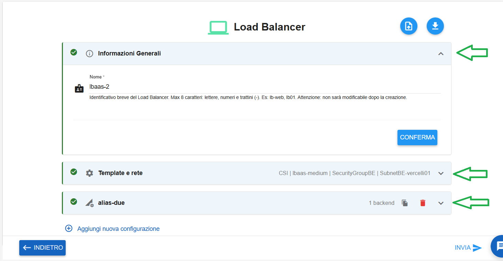

**Creare LBAAS tramite inserimento dati di input**
==================================================

1. Fare clic sul pulsante in alto a destra **Nuovo Load Balancer**:

.. image:: img/15.61a_Creare_LBAAS_dati_input1.png

|

Comparirà la seguente schermata:

Compilare il campo indicato, inserirendo manualmente il nome del Load Balancer 

*(Il nome rappresenta l'identificativo breve del Load Balancer. Max 8 caratteri: lettere, numeri e trattini (-). Es: lb-web, lb01*
*Attenzione: non sarà modificabile dopo la creazione)*

|

Quindi cliccare sul tasto a destra CONFERMA:

|

Si passerà al box successivo **Template e rete**

Compilare i campi indicati:

- selezionare il Template dal relativo menù a tendina

*(Determina la rete su cui verrà creato il Load Balancer. I template internet espongono il LB direttamente su Internet e non richiedono una subnet*
*il template csi colloca il LB sulle reti interne CSICloud (BE, WEB, RUPAR) e richiede la selezione di una subnet. Non è modificabile dopo la creazione)*

|

- selezionare il Flavour dal relativo menù a tendina

*(Dimensione del Load Balancer in termini di risorse (CPU, RAM). Si consiglia lbaas-medium nella quasi totalità degli scenari; lbaas-large solo in caso*
*di reali esigenze di capacità. Non è modificabile dopo la creazione)*

|

- selezionare il Security Group dal relativo menù a tendina

*(Gruppo di regole di rete che definisce quale traffico è autorizzato verso il Load Balancer)*

|

- selezionare la Subnet dal relativo menù a tendina

*(Rete interna (BE, WEB o RUPAR) a cui sarà collegato il Load Balancer. Richiesta solo quando il template è csi; non disponibile per i template internet)*

|

Inoltre la voce "Subnet" compare solamente se si seleziona il template "lbaas Reti Csi".

|

Quindi cliccare sul tasto a destra CONFERMA:

|

Se si desidera creare il Load Balancer senza ulteriori configurazioni è possibile procedere cliccando sul tasto in basso a destra INVIA:

|

Comparirà il seguente messaggio di conferma:

.. image:: img/15.61a_Creare_LBAAS_dati_input17.png

|

Il Load Balancer in creazione assumerà il seguente stato transitorio:

.. image:: img/15.61a_Creare_LBAAS_dati_input18.png

|

Al termine della creazione assumerà lo stato "available":

.. image:: img/15.61a_Creare_LBAAS_dati_input19.png

|

**Aggiungere ulteriori configurazioni**
***************************************

Aggiungendo i dati di questa sezione sarà obbligatorio creare anche almeno un backend per poter completare la creazione

Cliccare su **Aggiungi nuova configurazione**:

Compilare i campi indicati:

- inserire manualmente l'Alias Configurazione

*(Nome univoco di questa configurazione. Compare anche nella sezione frontend delle statistiche di HAProxy. Es: config-https, regola-api)*

|

- inserire manualmente l'FQDN

*(Dominio su cui il Load Balancer riceverà le richieste. Non includere http:// o https://. Es: mioservizio.example.it)*

|

- selezionare la porta 80 oppure 443 dal relativo menù a tendina

*(Porta su cui il Load Balancer ascolta le richieste in ingresso. Seleziona 80 per HTTP o 443 per HTTPS)*

|

- selezionare il protocollo HTTP oppure HTTPS dal relativo menù a tendina

*(Protocollo usato dai client per raggiungere il servizio)*

|

- se necessario incollare un certificato nella voce "Certificato SSL (PEM)"

*(Necessario se il protocollo è HTTPS. Incollare il testo completo in formato PEM, inclusa la chiave privata*
*e il certificato concatenati. Lasciare vuoto per HTTP)*

|

- se necessario flaggare Redirect HTTP (se attivo, le richieste HTTP, porta 80, vengono reindirizzate automaticamente a HTTPS) oppure Sticky Sessions (se attivo, le richieste dello stesso utente vengono sempre inviate allo stesso backend (persistenza di sessione)

|

Il pulsante CONFERMA in basso a destra non è ancora cliccabile perchè, come accennato all'inizio, occorre inserire almeno un backend.

|

**Aggiungere backend**
**********************

Cliccare su **Aggiungi backend**:

Compilare i campi indicati:

- inserire manualmente il nome del backend

- selezionare la VM dal relativo menù a tendina

- inserire manualmente la porta

- selezionare il protocollo HTTP oppure HTTPS dal relativo menù a tendina

|

Il tasto CONFERMA in basso a destra diventa cliccabile. Cliccarlo per salvare la configurazione appena inserita.
Se necessario inserire altri back-end.

|

La situazione riassuntiva sarà la seguente:

|

Cliccando sulle frecce a destra è possibile espandere le informazioni inserite fino ad ora:

|

Se necessario inserire ulteriori configurazioni. Al termine cliccare sul tasto INVIA.

|

Comparirà il seguente messaggio di conferma:

.. image:: img/15.61a_Creare_LBAAS_dati_input41.png

|

Il Load Balancer in creazione assumerà il seguente stato transitorio:

.. image:: img/15.61a_Creare_LBAAS_dati_input42.png

|

Al termine della creazione assumerà lo stato "available":

.. image:: img/15.61a_Creare_LBAAS_dati_input43.png
