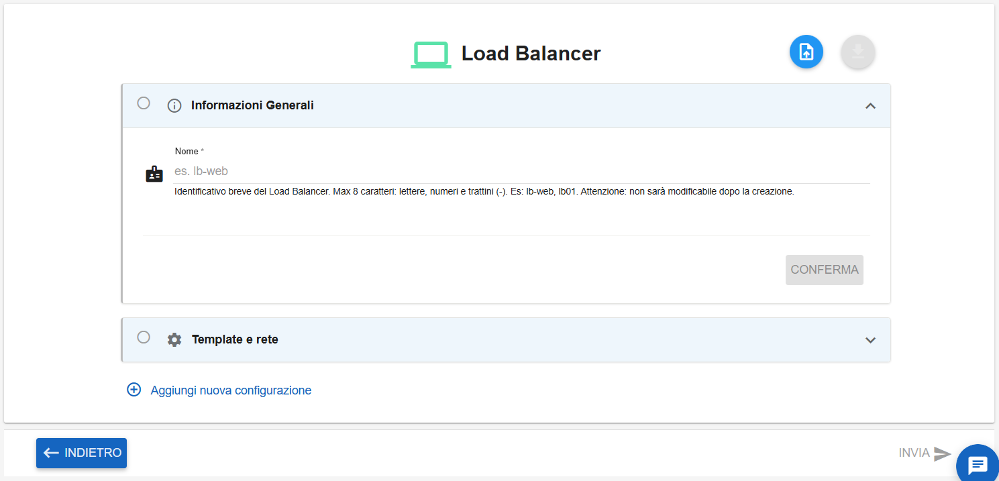
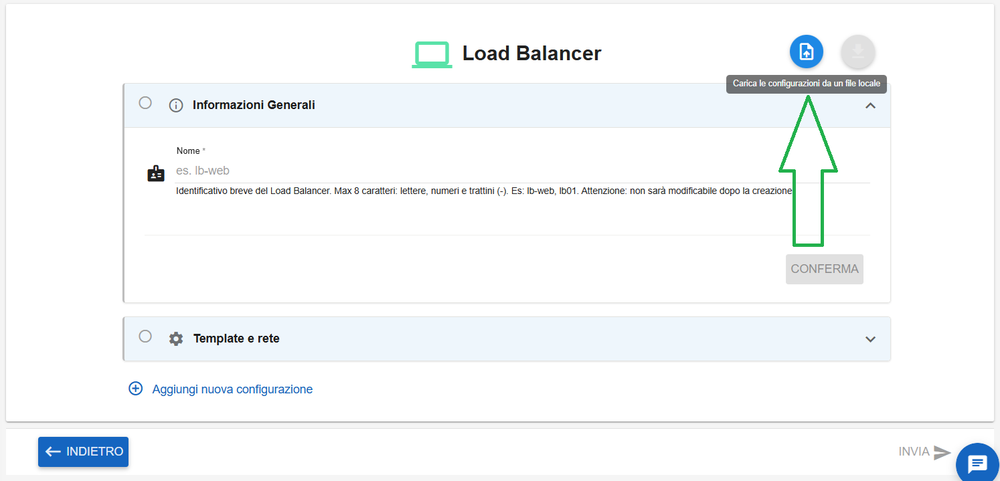
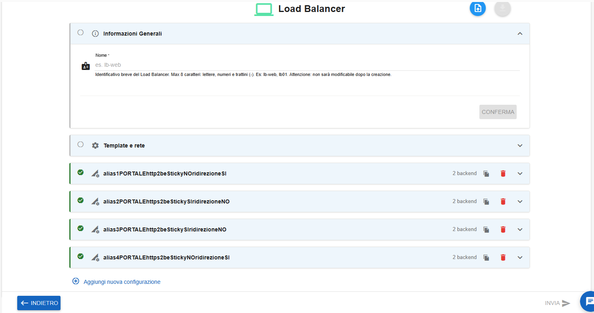
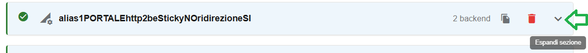
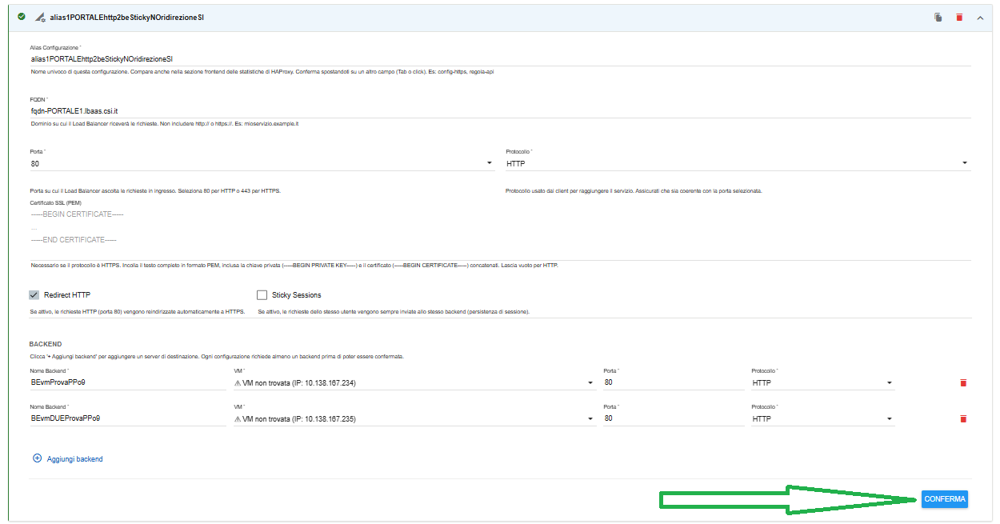
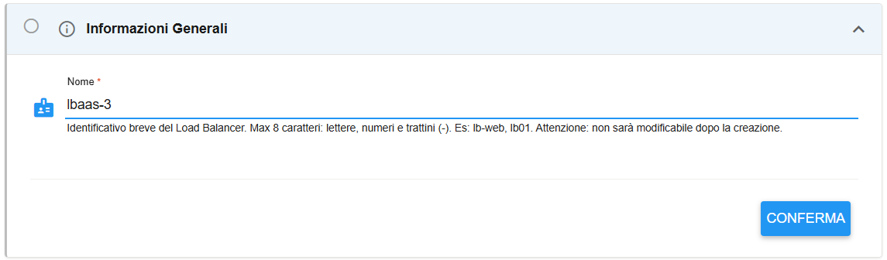
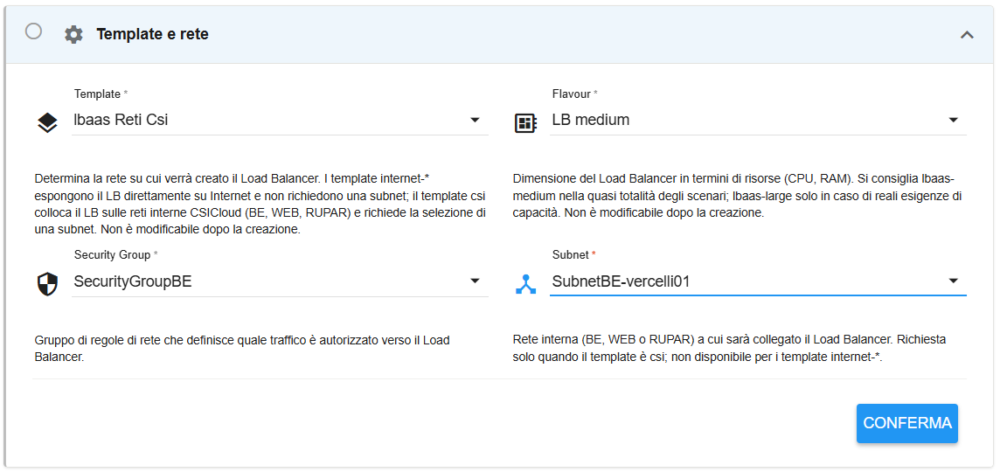
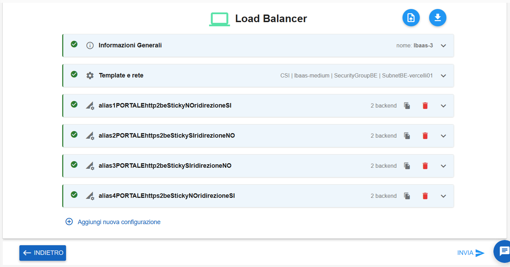
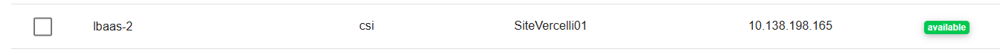

**Creare LBAAS tramite inserimento file json**
==============================================

1. Fare clic sul pulsante **+**, la cui descrizione passandoci sopra col mouse è **Nuovo Load Balancer**:

.. image:: img/15.61a_Creare_LBAAS_dati_input1.png

|

Comparirà la seguente schermata:

|

Cliccare sull'icona in alto a destra "**Carica le configurazioni da un file locale**":

|

Caricare il file json da risorse locali:

.. image:: img/15.61bb_Creare_LBAAS_json2.png

|

Verrà popolata la parte relativa ad **alias** e **backend**:

|

Per ogni configurazione aggiunta dal file json occorre entrare nella relativa sezione (cliccando su "Espandi sezione")
quindi validare i dati presenti cliccando su CONFERMA.

|

Compilare i dati mancanti:

1. Inserire il Nome e cliccare CONFERMA:

|

2. Inserirei i dati relativi a template e rete e cliccare su CONFERMA:

|

Solo a questo punto il pulsante **INVIA** in basso a destra diventerà selezionabile. Cliccarlo per lanciare la creazione:

|

Comparirà il seguente messaggio di conferma:

|

Il Load Balancer in creazione assumerà il seguente stato transitorio:

|

Al termine della creazione assumerà lo stato "available":

