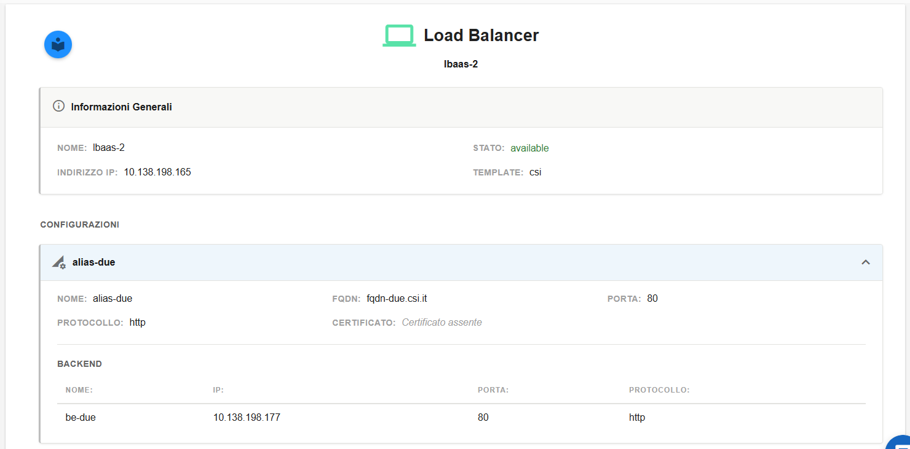

**Visualizzare dettaglio LBAAS**
================================

Per visualizzare il dettaglio di un LBAAS occorre selezionarne uno, quindi cliccare sull'icona in alto a destra "**Dettaglio Load Balancer**":

.. image:: img/15.62_Visualizzare_LBAAS1.png

|

Compariranno i dettagli di tutti gli alias e relativi backend:

