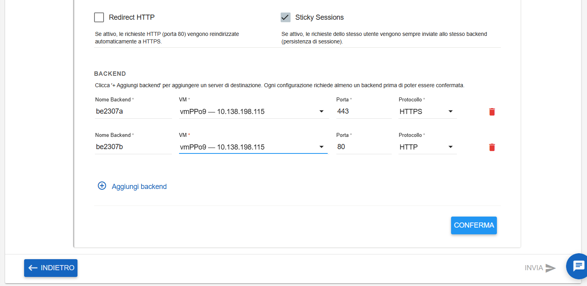
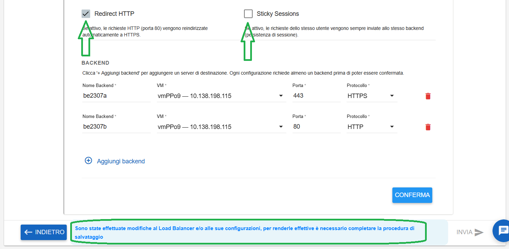
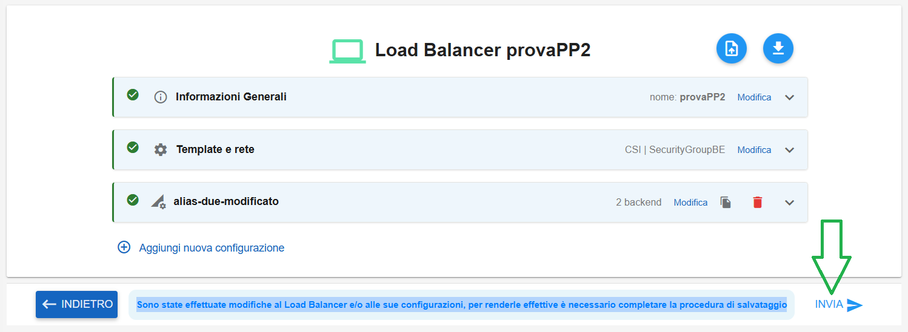

**Modificare LBAAS**
====================

Per modificare un LBAAS occorre selezionarne uno, quindi cliccare sull'icona in alto a destra "**Modifica Load Balancer**":

.. image:: img/15.64_Modificare_LBAAS1.png

|

Cliccare sul tasto **Modifica** relativo agli alias e relativi backend:

.. image:: img/15.64_Modificare_LBAAS31.png

|

Verrà mostrata la configurazione corrente:

|

Modificare i dati desiderati (in basso comparirà il messaggio "Sono state effettuate modifiche al Load Balancer e/o alle sue configurazioni, 
per renderle effettive è necessario completare la procedura di salvataggio").
Quindi cliccare su CONFERMA:

|

Quindi cliccare su INVIA (che a fronte delle modifiche inserite e confermate, sarà diventato selezionabile):

|

Comparirà il seguente messaggio di conferma:

.. image:: img/15.64_Modificare_LBAAS4.png

|

Il Load Balancer in modifica assumerà il seguente stato transitorio:

.. image:: img/15.64_Modificare_LBAAS5.png

|

Al termine della modifica assumerà lo stato "available":

.. image:: img/15.64_Modificare_LBAAS6.png
