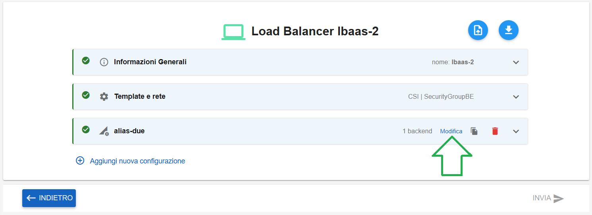
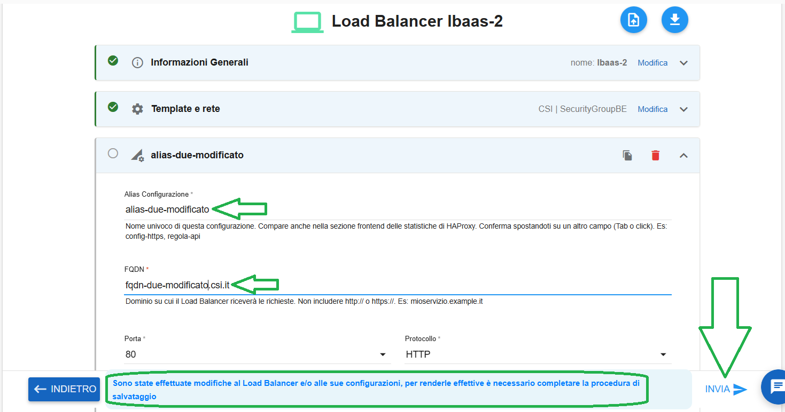

**Modificare LBAAS**
====================

Per modificare un LBAAS occorre selezionarne uno, quindi cliccare sull'icona in alto a destra "**Modifica Load Balancer**":

.. image:: img/15.64_Modificare_LBAAS1.png

|

Cliccare sul tasto **Modifica** relativo agli alias e relativi backend:

|

Modificare i dati desiderati, quindi cliccare su INVIA (che a fronte delle modifiche, sarà diventato selezionabile)

Comparirà il seguente messaggio di conferma:

.. image:: img/15.64_Modificare_LBAAS4.png

|

Il Load Balancer in modifica assumerà il seguente stato transitorio:

|

Al termine della modifica assumerà lo stato "available":

