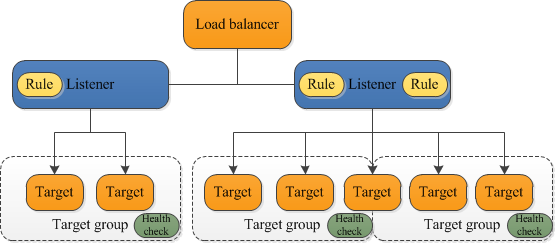

**Load Balancer**
*****************

Il load balancing è una tecnologia concepita per distribuire il carico di lavoro tra diversi server o applicazioni. 
L’obiettivo è ottimizzare le prestazioni globali, il rendimento e la capacità dell’infrastruttura.

Il modello di Servizio di Load Balancing è il seguente

Un bilanciatore si compone di 4 elementi:

- **Load balancer**: definisce l’indirizzo ip di frontend e la porta su cui avviene il bilanciamento del carico; ha riferimenti al target group e al listener;

- **Listener**: descrive la tipologia di traffico in ingresso al load balancer e le regole di inoltro alle macchine bilanciate (SSP Passthrough, cifratura lato client, cifratura lato client e lato server);

- **Target Group**: definisce l’algoritmo di bilanciamento, l’insieme degli host bilanciati (Target) e l’health monitor attraverso cui controllarne lo stato;

- **Health monitor**: controlla lo stato degli host bilanciati (raggiungibili, non raggiungibili).

La configurazione di un servizio di load balancing passa attraverso:

- la creazione di un health monitor custom (o la selezione di un health monitor predefinito);

- la creazione e il popolamento di un target group;

- la creazione di un listener custom (o la selezione di un listener predefinito);

- la creazione di un load balancer;

- la creazione di una regola per ciascuno dei security group delle vm bilanciate.
