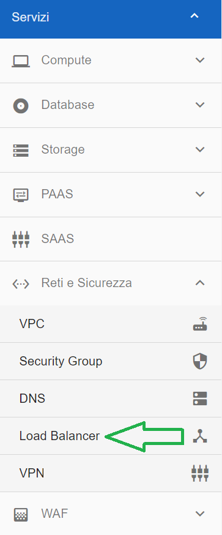
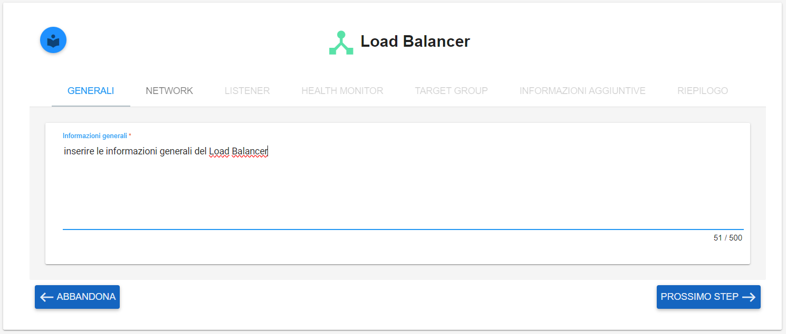
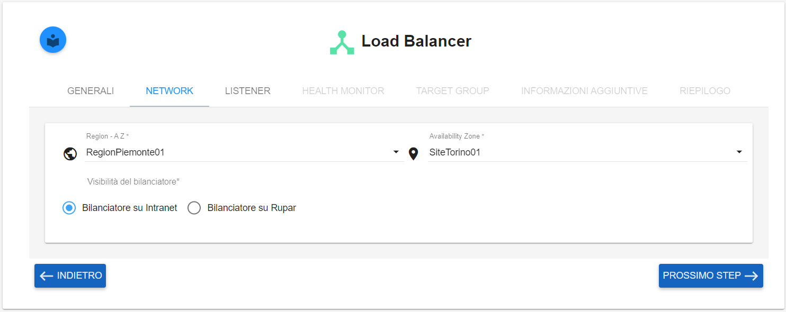
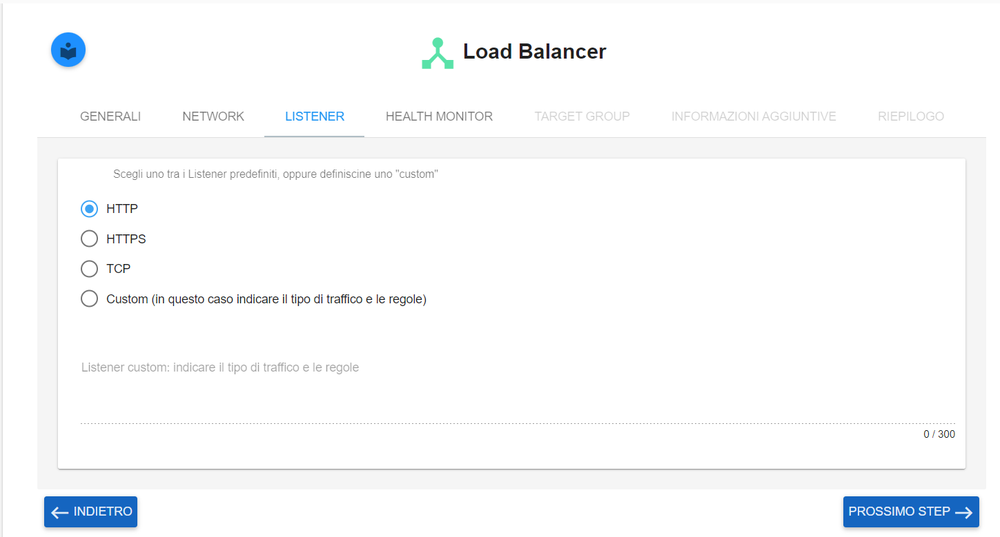
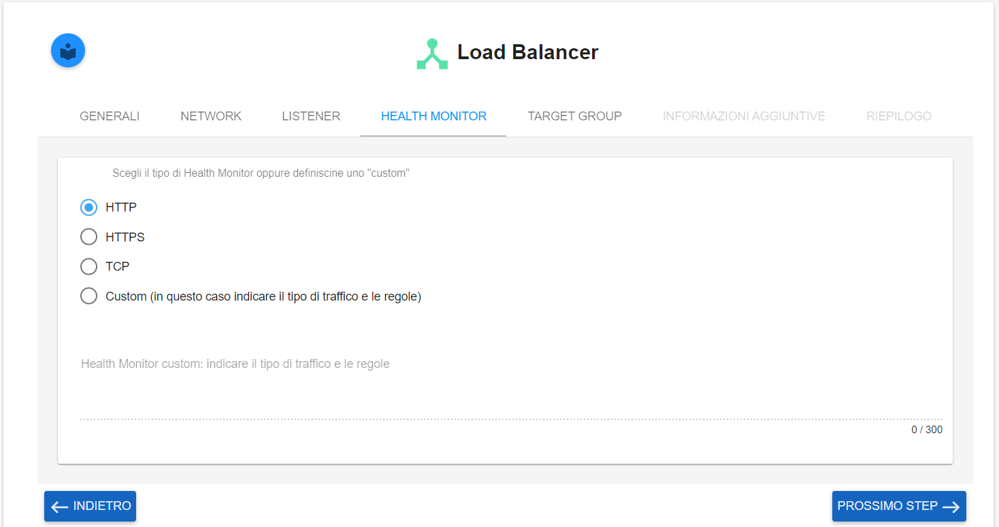
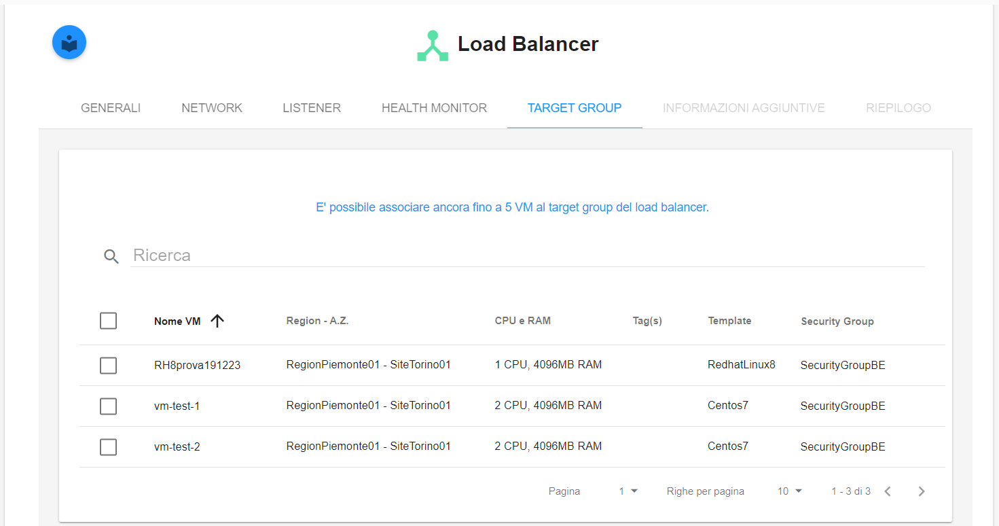
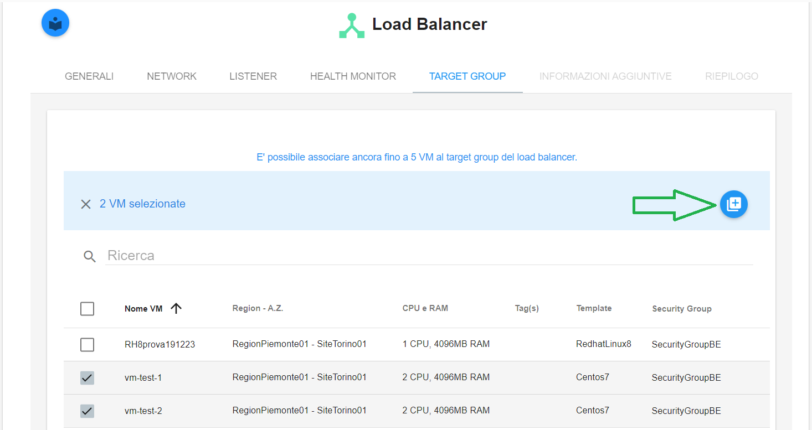
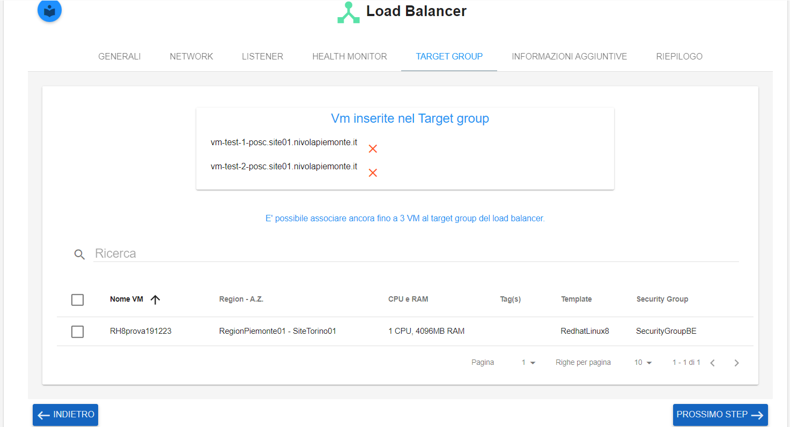
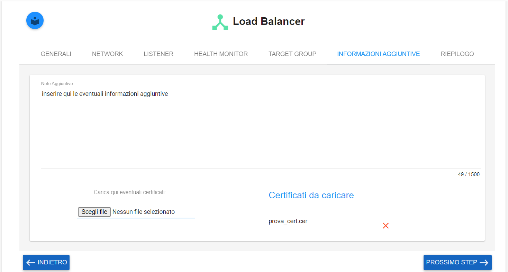
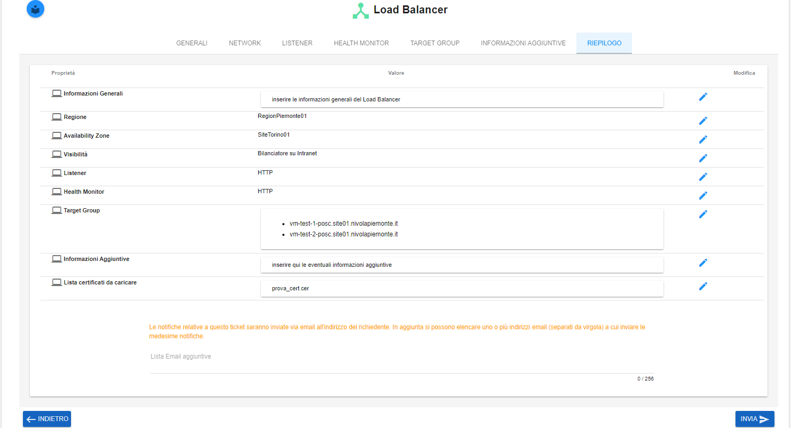

**Load Balancer**
*****************

Il load balancing è una tecnologia concepita per distribuire il carico di lavoro tra diversi server o applicazioni. 
L’obiettivo è ottimizzare le prestazioni globali, il rendimento e la capacità dell’infrastruttura.

Il modello di Servizio di Load Balancing è il seguente

.. image:: img/15.6_LB_overview.png

|

La funzione è attivabile attraverso il ruolo **Master di account**.
Occorre andare nella funzionalità **Load Balancer**, attivabile dalla parte sinistra dello schermo, all'interno del menù **Reti e Sicurezza**

|

Dalla schermata **Load Balancer** che appare, compilare i dati richiesti nei seguenti tab:

**GENERALI**

|

**NETWORK**

|

**LISTENER**

|

**HEALTH MONITOR**

|

**TARGET GROUP**

|

Associare le VM selezionandole, quindi cliccare sul tasto indicato dalla freccia

|

Verficare la lista delle vm selezionate, e cliccare su **PROSSIMO STEP**

|

**INFORMAZIONI AGGIUNTIVE**

Inserire le eventuali informzioni aggiuntive e caricare il certificato

|

**RIEPILOGO**

Verificare le informazione inserite e cliccare su **INVIA**

|

Comparirà il seguente messaggio a conferma della corretta apertura del ticket relativo al Load Balancer

