**VPN**
*******

                                        **GLOSSARIO**

- **Richiedente**: Amministrazione sottoscrittrice dell’offerta cui il presente documento costituisce allegato/Azienda che fa specifica richiesta del servizio attraverso la sottoscrizione dell’apposito accordo commerciale, che necessita del servizio d’accesso alla rete aziendale denominato “VPN SSL del CSI Piemonte” e/o nell’ambito della fruizione di Nivola, facendone richiesta tramite il proprio Referente master;

- **Utente**: utilizzatore finale del servizio VPN SSL, appartenente alla struttura organizzativa del Richiedente o dell’Operatore Economico;

|

**Compilazione dei dati per la richiesta di un’utenza VPN SSL per un utente della propria organizzazione** (*a cura del Richiedente*)
=====================================================================================================================================

L’utente *Richiedente* dopo aver effettuato il login sul Service Portal deve seguire i seguenti passaggi:

1)	Effettuare la selezione dal menù in alto del profilo di Master sull’account sul quale l’ *Utente* del servizio VPN SSL dovrà operare:

|

2)	Andare nel menù laterale e seguire il percorso **Servizi -> Reti e Sicurezza -> Richiesta attivazione VPN**
Comparirà la seguente interfaccia:

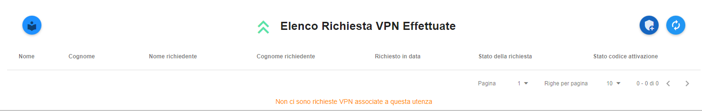

Qualora ci fossero delle richieste già effettuate verranno riportate in elenco con i relativi stati di avanzamento.

|

3)	Per inviare una nuova richiesta premere il pulsante:

|

Qualora non sia già stato dichiarato nell’arco dell’anno solare in corso verrà chiesto di accettare i termini e condizioni del servizio VPN SSL

.. image:: img/15.8_vpn4.png

|

Una volta cliccato su **Presa Visione dei termini di utilizzo** effettuando quindi il consenso ai termini e alle condizioni del servizio sarà possibile 
cliccare su **RICHIEDI UNA NUOVA VPN** e proseguire.

Comparirà la seguente interfaccia:

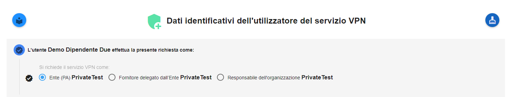

La prima scelta da effettuare riguarderà il ruolo del richiedente all’interno dell’organizzazione Nivola con cui si sta operando:

-	**Dipendente Referente Ente (PA)**: selezionare questa opzione nel caso il richiedente sia il responsabile dell’ente corrispondente all’organizzazione Nivola riportata in alto (nell’esempio PrivateTest)

-	**Fornitore delegato dall’Ente**: selezionare questa opzione nel caso il richiedente sia il responsabile (utente master di account) di un’azienda fornitrice che è stata delegata dall’Ente di PA (in questo caso PrivateTest) nella gestione delle risorse dispiegate su Nivola. Successivamente dovrai specificare anche la ragione sociale dell’azienda di appartenenza.

-	**Responsabile o collaboratore azienda certificata**: selezionare questa opzione nel caso in cui il richiedente sia il responsabile di un account appartenente ad un’organizzazione (nell’esempio PrivateTest) afferente ad un’azienda certificata su Nivola.

|

Una volta selezionato il ruolo del richiedente si passa all’anagrafica dell’utente: inserire il codice fiscale **completo** dell’utente destinatario del servizio

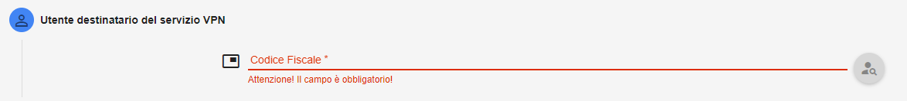

Quindi premere il pulsante:

|

Il sistema effettua una ricerca dell’utente nei propri archivi: se trovato vengono prepopolati i campi Nome, Cognome e e-mail aziendale. Altrimenti bisogna 
provvedere all’inserimento manuale dei dati

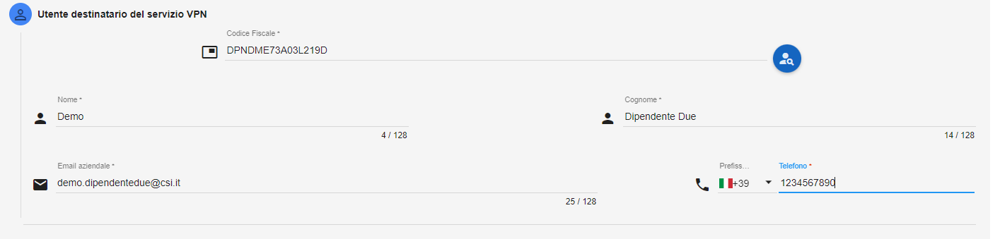

|

Se l’utente non è stato trovato negli archivi compariranno anche le opzioni **Crea anche l’accesso al Service Portal** e **Crea l’accesso alla CLI**: 
se selezionate verranno create le utenze presso i due sistemi

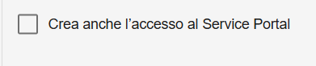

|

Procedere con l’inserimento dei dati dell’azienda presso la quale lavora il destinatario del servizio VPN: se il richiedente sta presentando la richiesta come 
**Fornitore delegato dall’Ente** verrà richiesta anche la ragione sociale dell’azienda delegata

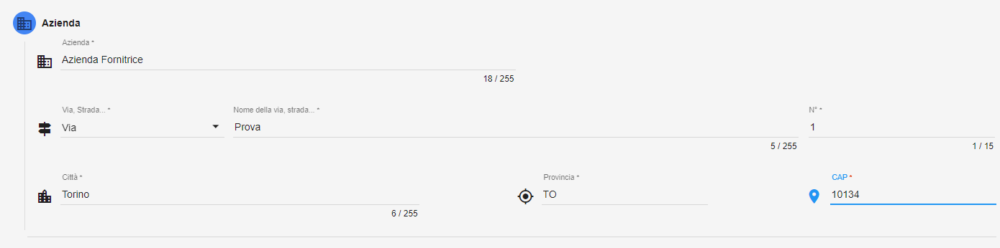

|

Una volta inseriti tutti i dati premere:

|

Verrà proposta una schermata riepilogativa dei dati inseriti

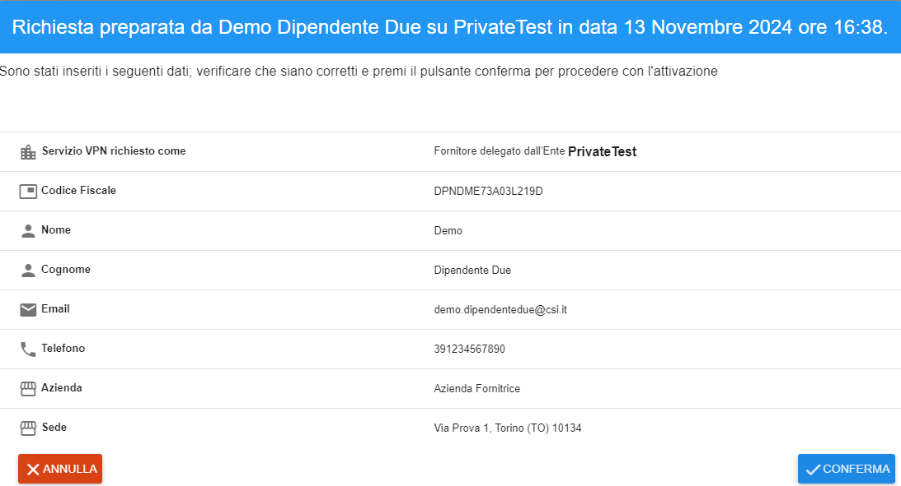

Controllare attentamente i dati e se corretti premere il pulsante:

|

Comparirà la seguente schermata

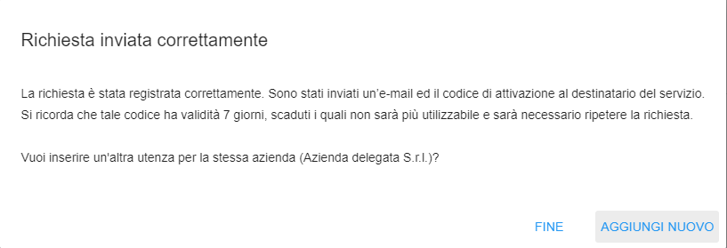

Qualora si intenda effettuare una richiesta per un altro utente appartenente alla stessa organizzazione e azienda premere su  **AGGIUNGI NUOVO**: verrà riproposta 
la pagina di inserimento dati con i dati della sezione “azienda” già popolati.
Altrimenti premere **FINE**

|

|

**Guida all’inserimento del codice attivazione per la VPN (a cura dell’Utente del servizio VPN)**
=================================================================================================

Per confermare la propria identità è necessario accedere al Nivola Service Portal all’url https://portal.nivolapiemonte.it : verrà mostrata la seguente pagina

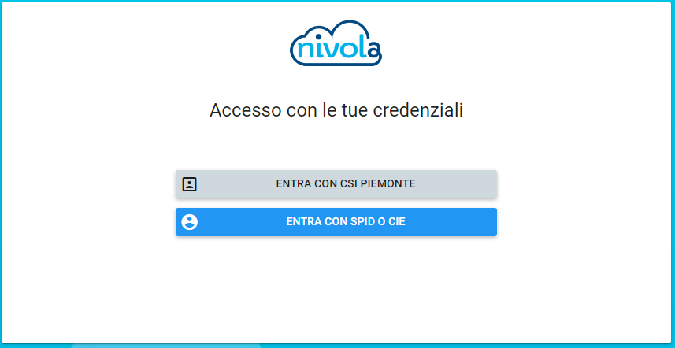

|

Utilizzando le credenziali SPID per effettuare un primo accesso e verrà mostrato in alto il seguente banner: 

|

Cliccando su **QUI** comparirà la pagina per inserire il codice di attivazione:

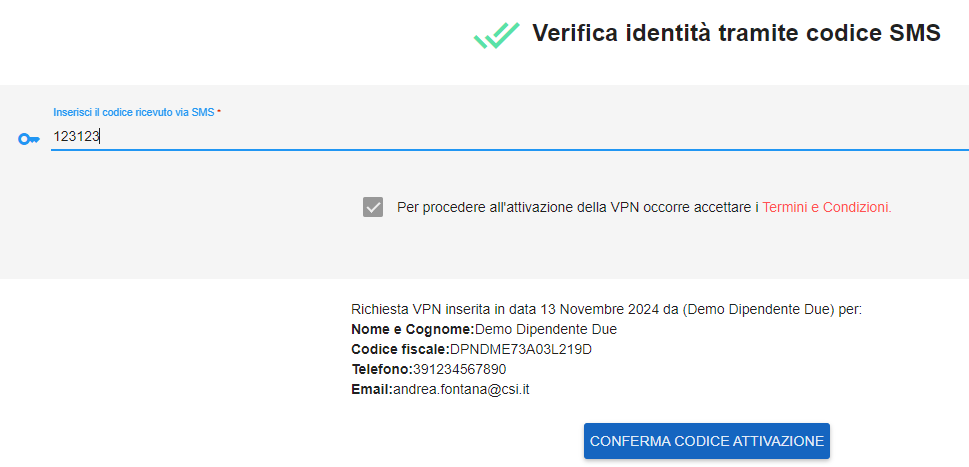

|

Inserire il codice di attivazione di sei cifre ricevuto sul proprio numero di telefono e procedere con l’accettazione dei **Termini e condizioni**. 
**E’ importante ricordare che il codice di attivazione ha validità di sette giorni solari a partire dalla data in cui la richiesta è stata compilata**.
Se l’operazione è andata a buon fine comparirà la seguente schermata:

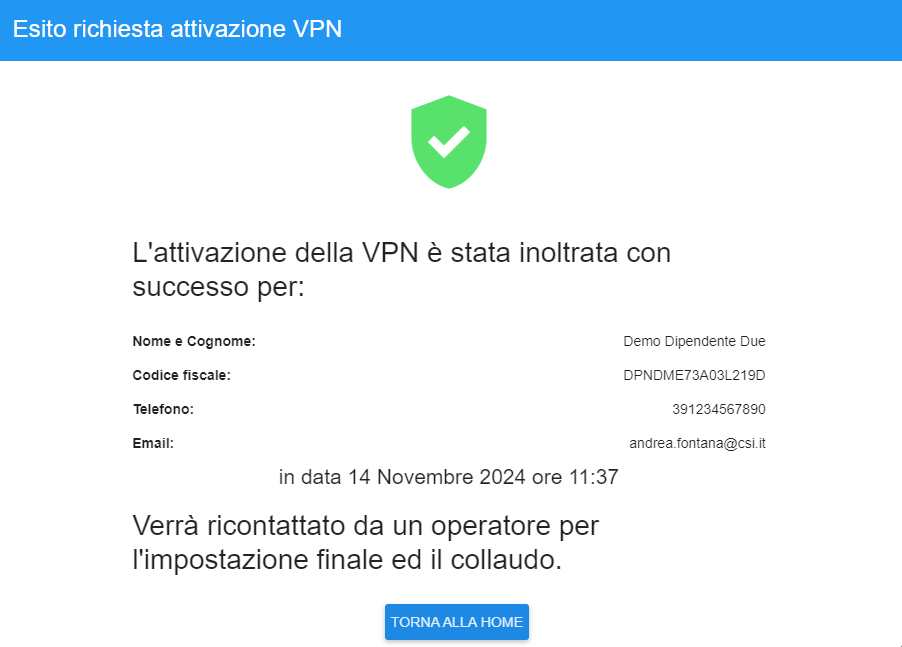

A questo punto basta attendere di essere contattato da un operatore per l’impostazione finale ed il collaudo.

|

Qualora al posto della schermata sopra proposta dovesse comparire un errore del tipo

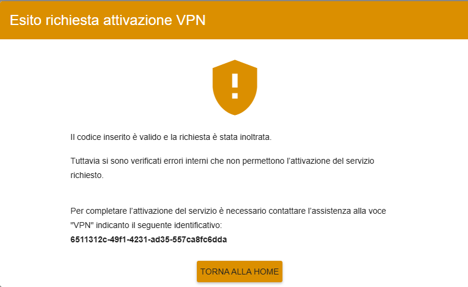

|

Bisognerà aprire un ticket selezionando la voce “VPN” includendo i dati richiesti dalla presente schermata. Questa operazione potrà essere effettuata da qualsiasi master di account da cui è partita la richiesta, anche dal richiedente stesso.
