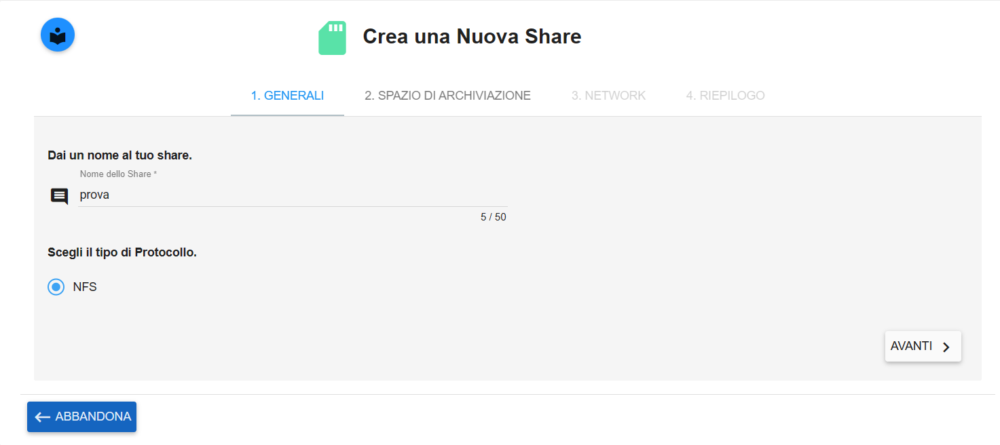
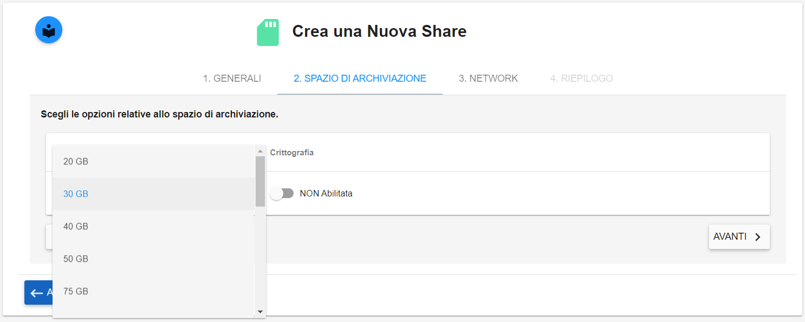
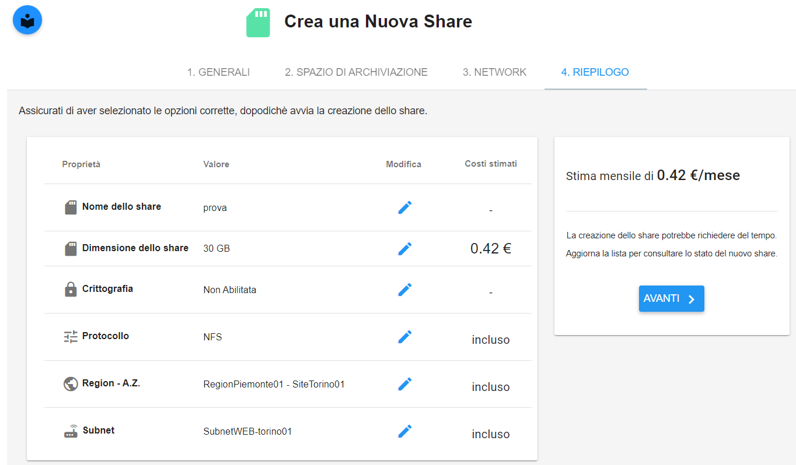

.. _Creare_STAAS:

**Creare lo Storage as Service**
********************************

Per la creazione di share, procedere come segue

1. Fare clic sul pulsante **"+""**:

.. image:: img/Add_VM.png

|

2. Inserire il Nome dello share nella textbox, selezionare il protocollo corretto e cliccare il pulsante **AVANTI**

|

3. Specificare **dimensione** dello Share indicando uno dei valori presenti nella combo box, attivare facoltativamente 
la **crittografia** sullo share che si sta creando e proseguire premendo il pulsante **AVANTI**

|

4. Sfruttando le combo box, proposte, inserire: **Region, Availability Zone,
Subnet**.  Al termine cliccare su **AVANTI**;

.. image:: img/STAAS_crea_vai_riepilogo.png

|

5. Controllare i parametri inseriti e cliccare su **AVANTI**;

|

6. Lo storage creato comparire nell'elenco;

.. image:: img/STAAS_crea_termina.png
