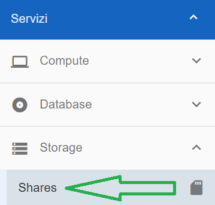
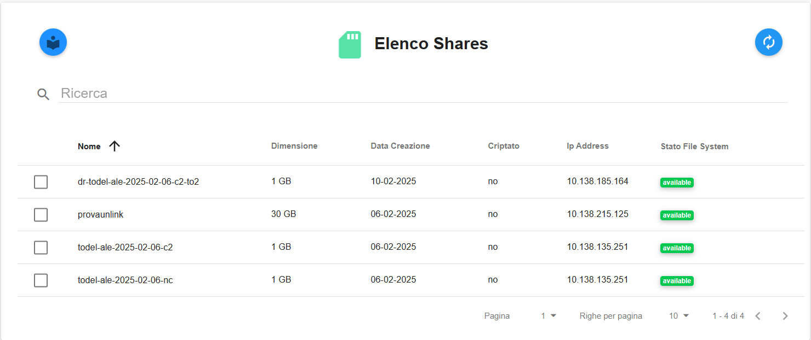
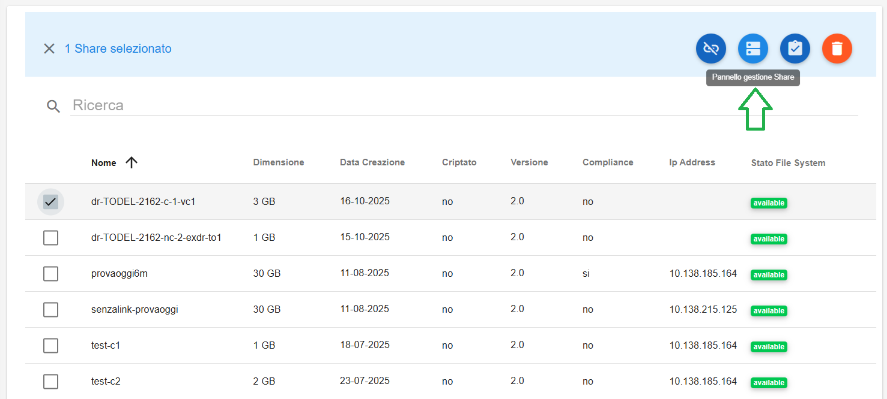
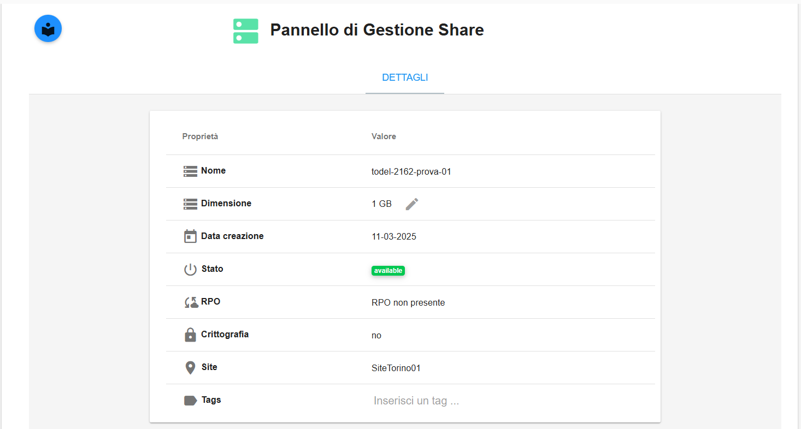
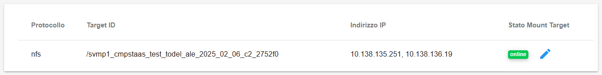
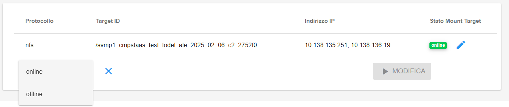

.. _Elenco_Share_Dettaglio:

**Elenco Shares**
*****************

La funzione rientra nel servizio **Compute**. L'**Elenco Shares** è attivabile dalla parte
sinistra dello schermo, cliccando sulla label **Shares** sotto **Storage**

|

A seguito di un clic su **Shares**, il sistema popolerà la
parte destra del video con l'**Elenco Shares**.

|

**Dettaglio Share**
*******************

Selezionando lo share desiderato e cliccando sul pulsante **Pannello gestione Share** sarà possibile consultare il dettaglio

|

Verrà visualizzata la seguente pagina

Nella finestra di dettaglio sono stati aggiunti i parametri: **RPO**, **Crittografia** e **Site**.

Rimane possibile modificare la dimensione del Volume e aggiungere/eliminare Tag.

|

Inoltre, nella tabella del **Mount Target** è stato aggiunto uno stato che potrà essere **Online**, **Offline** o **Not Available** nel caso in cui il Volume non abbia un Mount Target. 

|

Questo stato è modificabile tramite il bottone **Modifica lo Stato**

