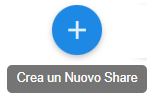
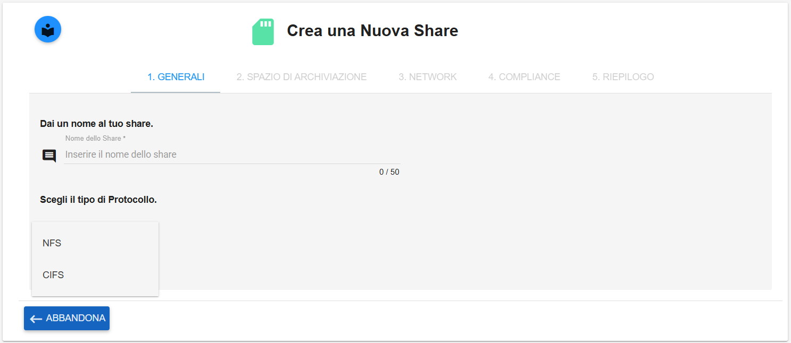
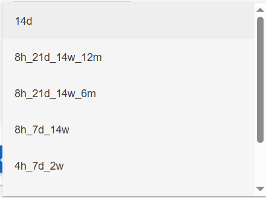
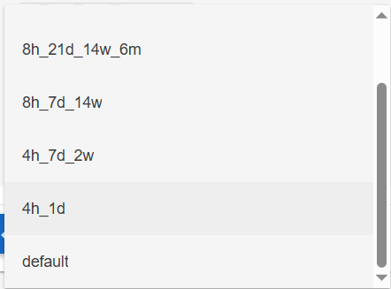
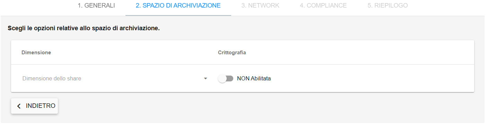
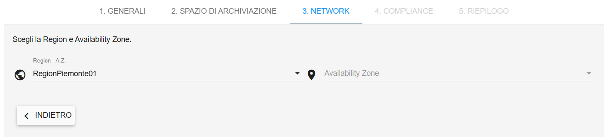
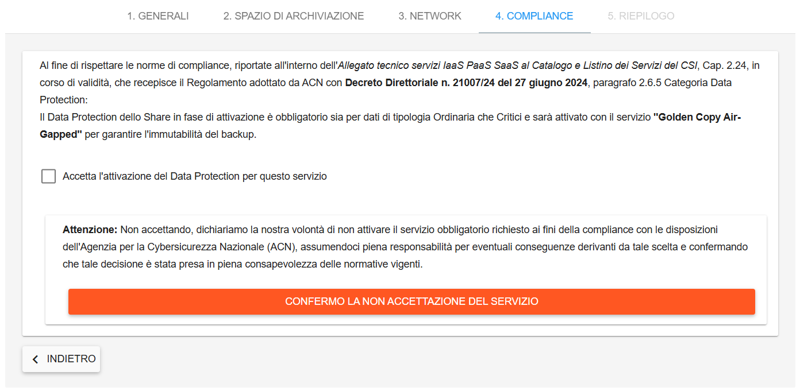
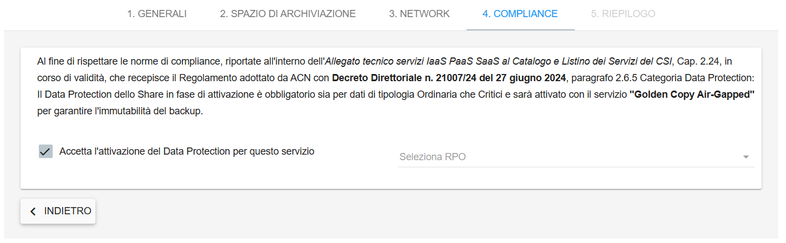
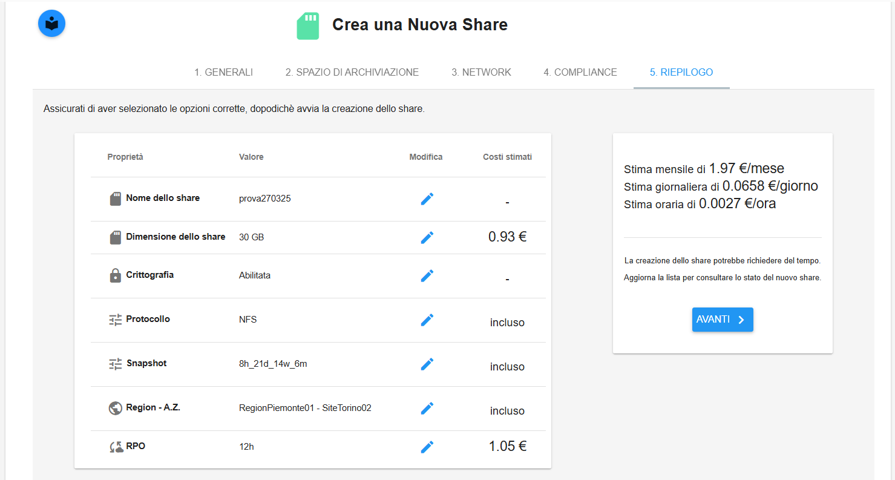

.. _Creazione_nuovo_Share:

**Creazione Nuovo Share**
*************************

Per la creazione di uno share, procedere come segue:

Fare clic sul pulsante in alto a destra **Crea Nuovo Share**

|

**Tab Generali**

È stato aggiunto un controllo sul nome che non potrà iniziare per **dr-**, prefisso dedicato alle repliche.
Come tipo di **protocollo** è possibile scegliere tra **NFS** o **CIFS**

Relativamente alle **Snapshot Policy** scegliere fra uno dei valori in elenco

|

**Tab Spazio di Archiviazione**

Si dovrà selezionare la dimensione e scegliere se lo share sarà criptato o no

|

**Tab Network**

Si dovrà selezionare l’Availability Zone. È stata eliminata la selezione della Subnet

|

**Tab Compliance**

E' presente una checkbox preselezionata. Se l’utente andrà a deselezionarla verrà mostrato un warning con un messaggio e un pulsante di 
conferma lettura che permetterà all’utente di proseguire la creazione senza accettare le norme della compliance

Se invece la checkbox rimane selezionata viene mostrata una drop-down list dove occorrerà scegliere l’RPO

|

**Tab riepilogo**

Controllare che le configurazioni dello share da creare siano corrette e confermare premendo sul 
pulsante **AVANTI** sulla destra. Il portale procederà alla creazione dello share utilizzando i parametri inseriti

|

Un messaggio in verde in alto a destra darà conferma dell'avvenuta creazione

