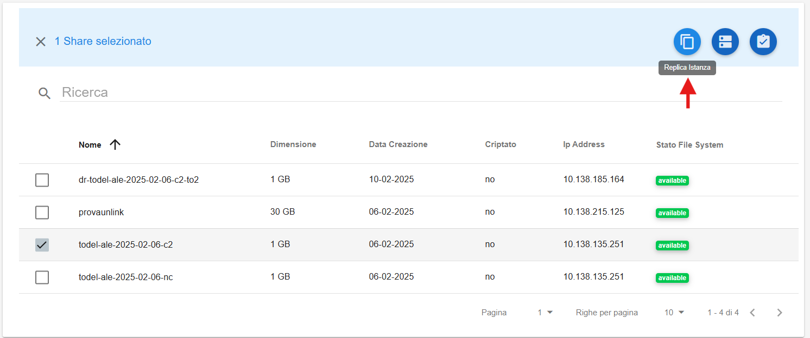
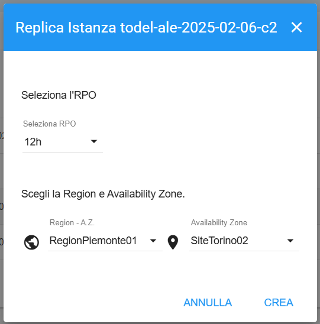
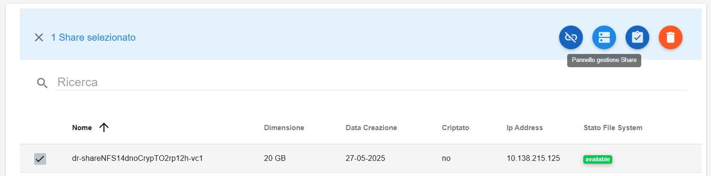
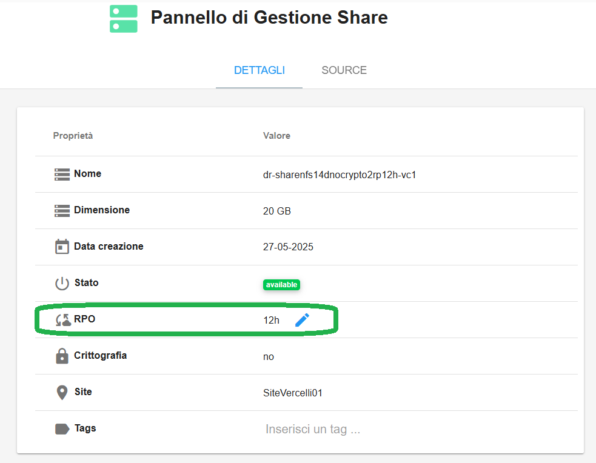
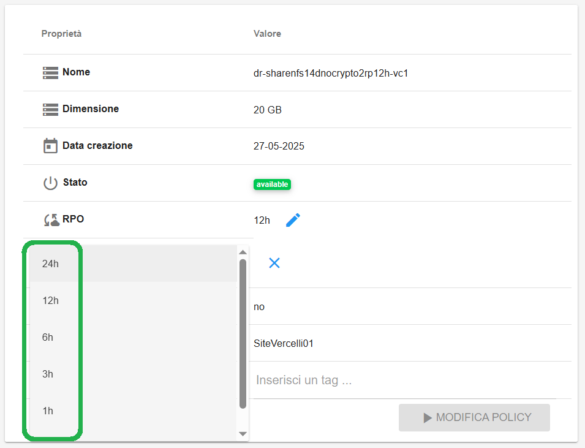
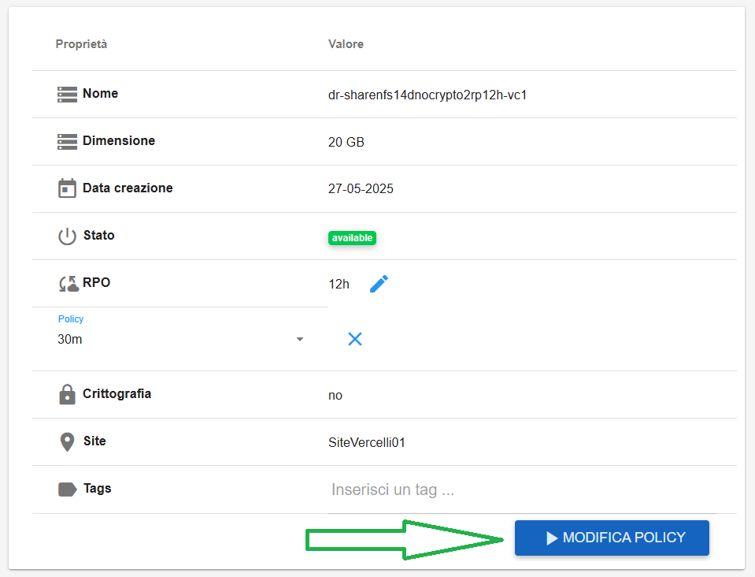

.. _Replica_Share.rst:

**Replica Share**
*****************

Selezionando lo share che si desidera replicare e cliccando sul bottone **Replica Istanza** si aprirà la finestra dedicata.

|

Occorrerà scegliere **RPO**, **Region** e **Availability Zone**. L’Availability Zone deve essere diversa da quella dello share di origine

Lo share replica avrà lo stesso nome dello share di origine con l’aggiunta del prefisso dr- e del postfisso sigla dell’Availability Zone (es. **dr-<nome>-to2**)

|

Un messaggio in verde in alto a destra darà conferma dell'avvenuta creazione

|

**Modifica RPO Replica**
************************

Una volta creata la replica è possibile modificare se necessario il valore RPO impostato in creazione.

Occorre selezionare una replica e cliccare su **Pannello gestione Share**

|

Quindi cliccare sul simbolo della matita a fianco di **RPO**

|

Scegliere uno dei valori proposti:

|

Quindi cliccare su **MODIFICA POLICY**

