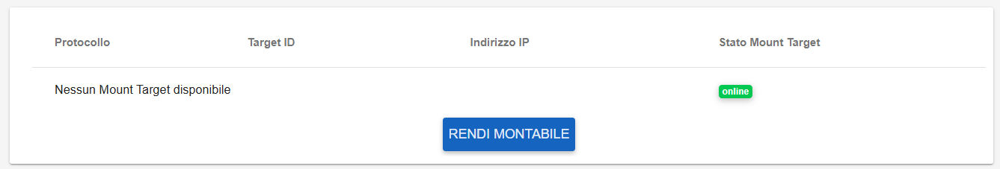
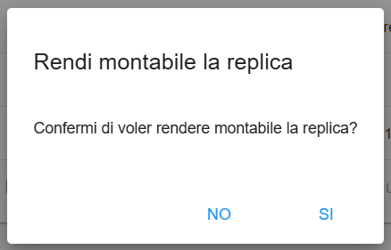

.. _Mount_Share.rst:

**Mount Share**
***************

Se uno share o una replica non hanno il **Mount Target**, è possibile rendere la share montabile.
Andare nei **dettagli** dello share, nella sezione in basso dedicata al Mount Target sarà presente un pulsante che rende montabile la Share

|

Un messaggio in verde in alto a destra darà conferma dell'avvenuta creazione

.. image:: img/16.4_Mount_Share3.png
    