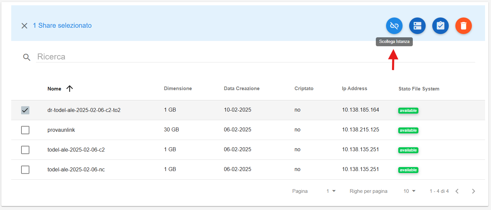
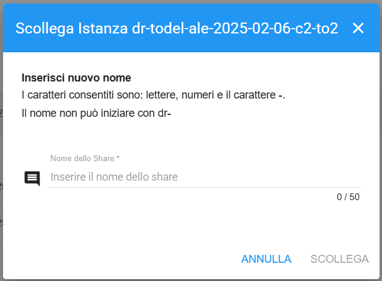

.. _Unlink_Replica:

**Unlink di una Replica**
*************************

Selezionando uno Share Replica viene reso disponibile il bottone **Scollega Istanza**.
Questo Bottone permette di rendere indipendente la Replica dal suo Volume di origine.

|

Viene aperta una finestra dove viene chiesto un nuovo nome, che esattamente come nella creazione share, non può iniziare per **dr-**.

|

Un messaggio in verde in alto a destra darà conferma dell'avvenuto scollegamento della replica e conseguente creazione di uno share indipendente

