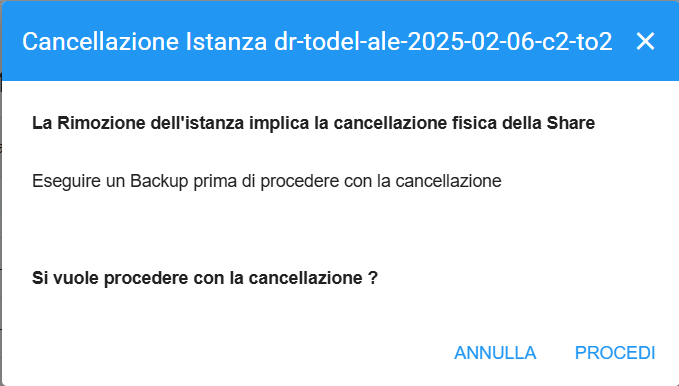
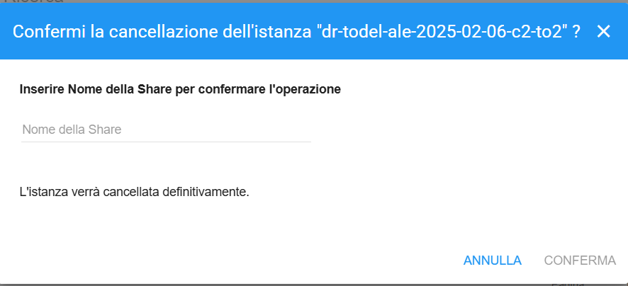
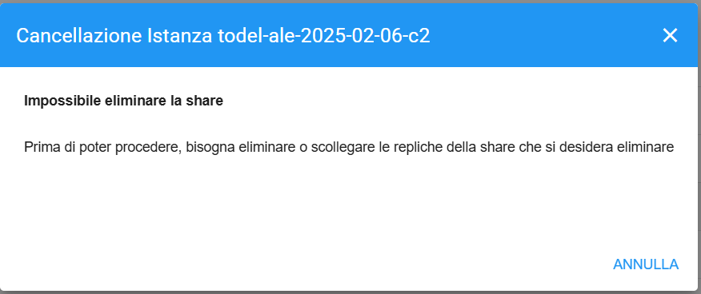

.. _Eliminazione_Share:

**Eliminazione Share**
**********************

Selezionare lo share che si desidera eliminare, cliccare sul bottone **Elimina Share**, verrà aperta la finestra di cancellazione

.. image:: img/16.6_Eliminazione_Share1.png

|

Se lo share selezionato è una replica oppure uno share a cui non sono legate delle repliche, sarà possibile procedere nell’eliminazione. 
Verrà chiesta prima conferma, e poi verrà chiesto di inserire il nome dello share selezionato per conferma

|

Se invece lo share selezionato ha delle repliche collegate non sarà possibile procedere con l’eliminazione

