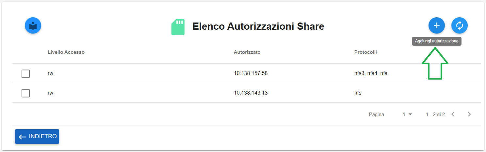
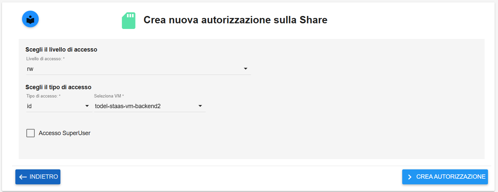
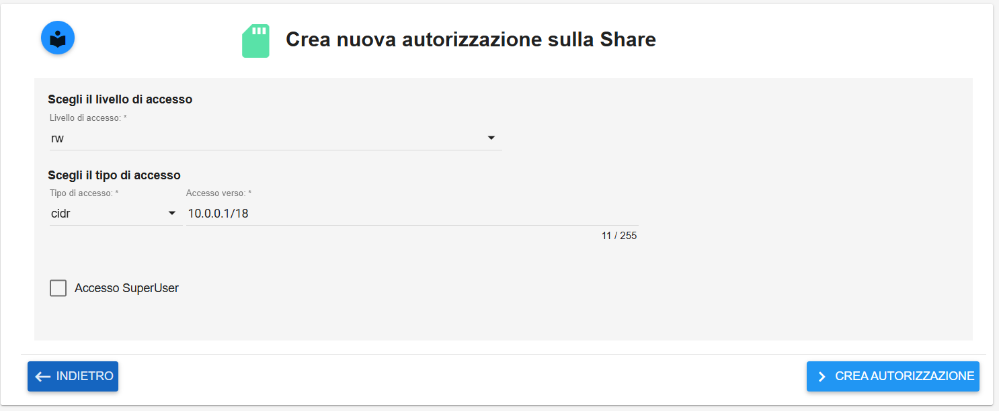

.. _Creazione_Autorizzazioni_Share:

**Creazione Autorizzazioni Share**
**********************************

Se si desidera aggiungere un’autorizzazione occorre entrare nei **Dettagli** dello share, selezionarlo e cliccare sul bottone **Aggiungi autorizzazione**

|

Verrà aperta la finestra di creazione dove bisognerà inserire il livello di accesso, il tipo di accesso e se si vuole un accesso SuperUser.

Il tipo di accesso può essere di tipo **id**, dove si dovrà selezionare una Virtual Machine che deve essere attestata sullo stesso site dello Share

|

Oppure potrà essere di tipo **CIDR**, dove occorrerà inserire l’indirizzo IP desiderato

|

Un messaggio in verde in alto a destra darà conferma dell'avvenuta operazione

