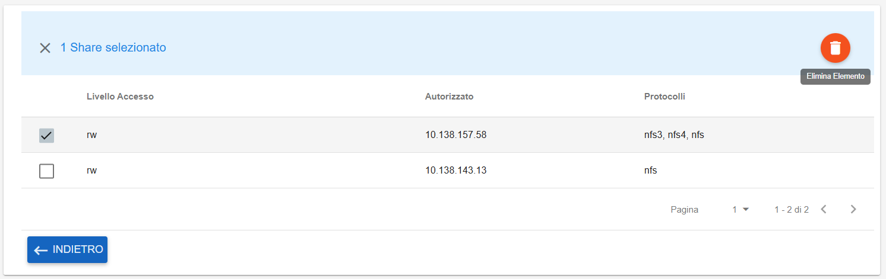

.. _Eliminazione_Autorizzazione_Share:

**Eliminazione Autorizzazione Share**
*************************************

Se si desidera eliminare un’autorizzazione occorre entrare nei **Dettagli** dello share, selezionarlo e cliccare sul bottone **Elimina Elemento**

|

Un messaggio in verde in alto a destra darà conferma dell'avvenuta operazione

