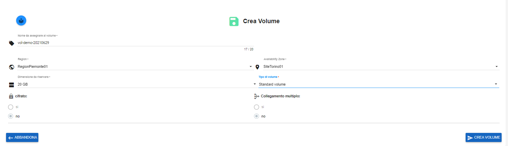
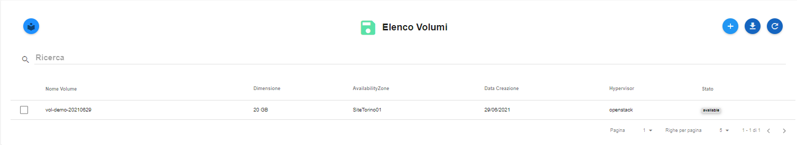

.. _Attach_VOLUME:

**Attach di un Volume**
***********************

Per fare un attach di un volume, procedere come segue:

1. Fare clic sul pulsante **"+""**:

.. image:: img/Add_VM.png

2. Inserire il **Nome del volume** con tutti i parametri richiesti e premere il pulsante **CREA VOLUME**;

3. Il sistema avviserà dell'avvenuta creazione del volume, con il seguente messaggio;

4. L'istanza creata apparirà, nella lista dei volumi, con lo stato impostato ad **"available"** ;

