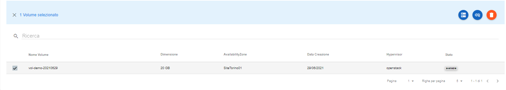
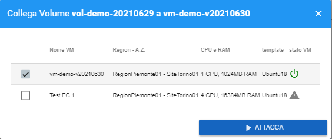
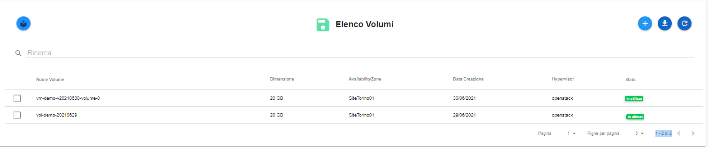

.. _Attach_VOLUME:

**Attach di un Volume**
***********************

Per fare l'**attach** di un volume, occorre:

1. Selezionare il volume, spuntando la checkbox:

2. Premere il pulsante **Attach**;

.. image:: img/Pulsante_connetti.png

3. Proseguire, usando il pulsante **Attacca**;

4. Al termine, il volume, comparià nell'elenco con lo stato impostato a **In utilizzo** ;

