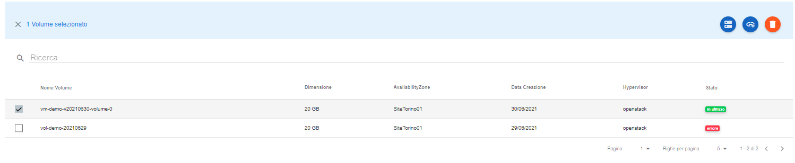
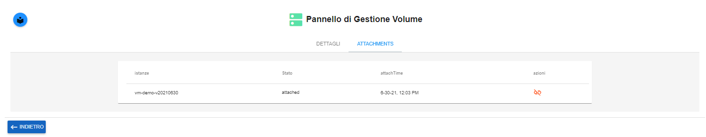
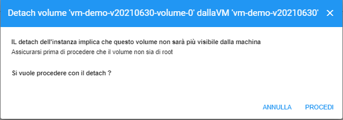

.. _Dettach_VOLUME:

**Dettach di un Volume**
************************

Per fare un dettach di un volume, è necessario seguire questi passaggi:

1. Selezionare il volume dall'elenco:

2. Premere il pulsante **Visualiza dettagli volume**;

.. image:: img/VM_Pannello_controllo.png

3. Raggiunto il **Pannello di Gestione Volume**, optare per il folder **ATTACHMENTS** ;

4. Per scollegare il volume, utilizzare il pulsante **"Dettach"**, sotto la label **azioni**;

5. Confermare il **Dettach del volume**, usando il tasto **PROCEDI**;

