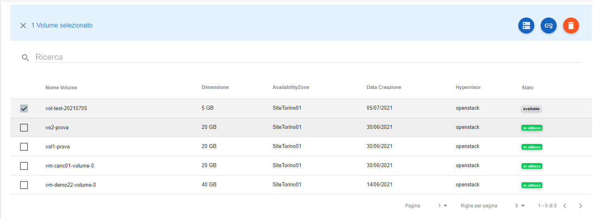
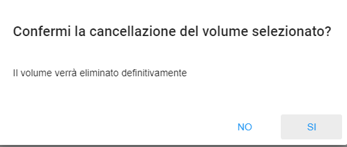
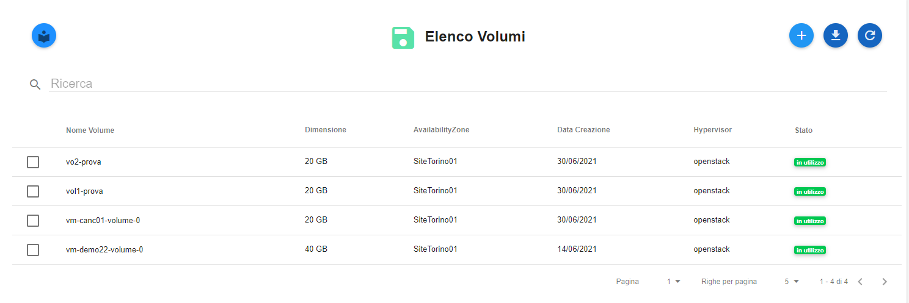

.. _Cancella_VOLUME:

**Cancellare un Volume**
************************

Per eliminare un volume, procedere secondo questa scaletta:

1. Dall'elenco, selezionare il volume da cancellare, facendo attenzione che sia in stato **available**:

2. Premere l'icona **Elimina Volume**;

.. image:: img/Pulsante_cancella.png

3. Rispondere **SI** alla richiesta di **Conferma**;

4. Il volume cancellato sparirà dall'elenco;

