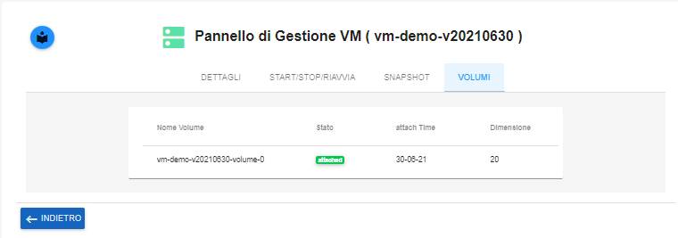

.. _Elenco_VOLUMI:

**Elenco Volumi**
=================
La funzione rientra nel **servizio compute**. La **Creazione Snapshot** è attivabile dalla parte
sinistra dello schermo, cliccando sulla label **VM** sotto **Compute**

.. image:: img/VM_innesco_crea.png

A seguito di un clic su **VM**, il sistema popolerà la
parte destra del video con l'**Elenco delle VM**.
Per consultare la lista dei **VOLUMI**, procedere in questo modo:

1. Selezionare la VM

.. image:: img/Snap_elenco_vm.png

2. Fare clic sul pulsante:

.. image:: img/VM_Pannello_controllo.png

3. Selezionare la voce **VOLUMI**, per ottenere l'elenco desiderato:

