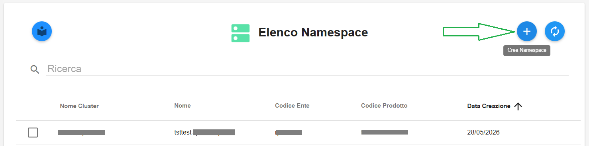
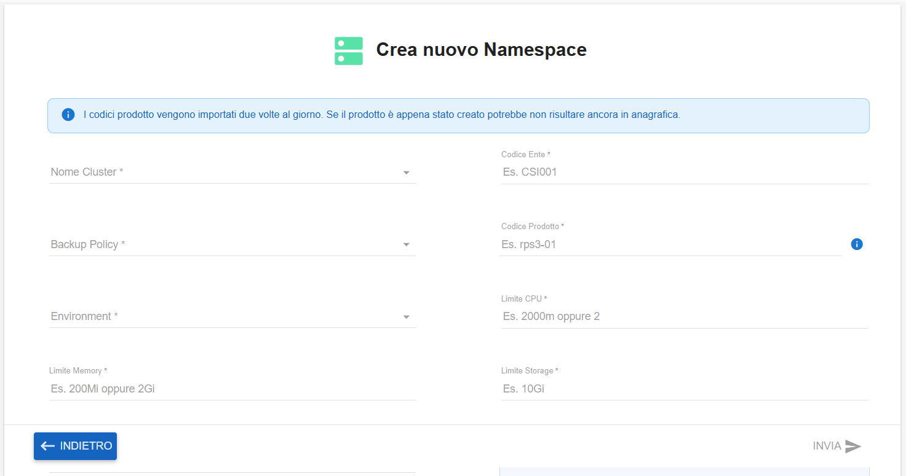
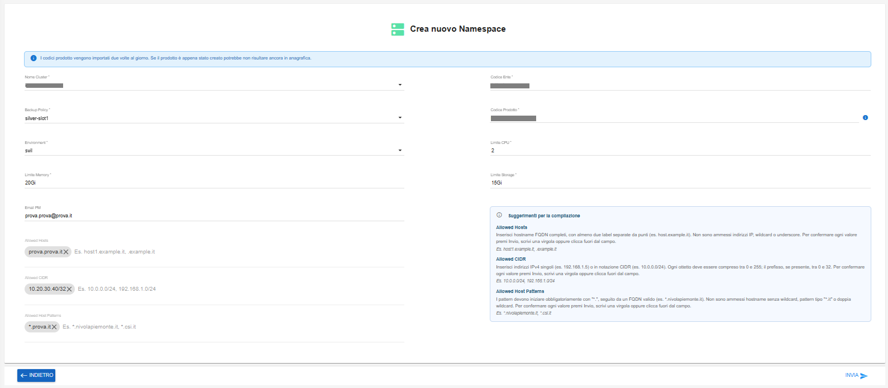

**Creare Namespace (ECAAS)**
============================

1. Fare clic sul pulsante in alto a destra **Crea Namespace**:

|

Comparirà la seguente schermata:

|

Compilare i campi indicati:

- selezionare il Nome Cluster dal relativo menù a tendina

- selezionare il Backup Policy dal relativo menù a tendina

- selezionare l'Environment dal relativo menù a tendina

- inserire manualmente il Limite Memory

- inserire manualmente l'Email PM

- inserire manualmente l'Allowed Hosts

- inserire manualmente l'Allowed CIDR

- inserire manualmente l'Allowed Host Patterns

- inserire manualmente il Codice Ente

- inserire manualmente il Codice Prodotto

- inserire manualmente il Limite CPU

- inserire manualmente il Limite Storage

|

Al termine cliccare sul tasto in basso a destra **INVIA**

|

Comparirà il seguente messaggio di conferma:

