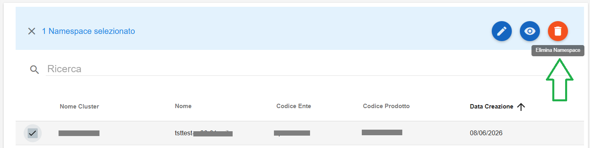
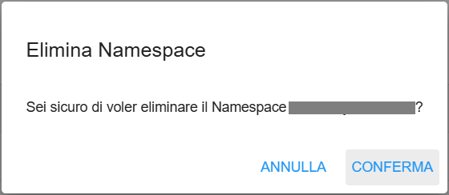

**Cancellare Namespace (ECAAS)**
================================

Per cancellare un Namespace (ECAAS) occorre selezionarne uno, quindi cliccare sull'icona in alto a destra "**Elimina Namespace**":

|

Comparirà la seguente richiesta di conferma di cancellazione:

