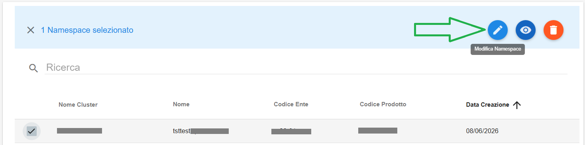
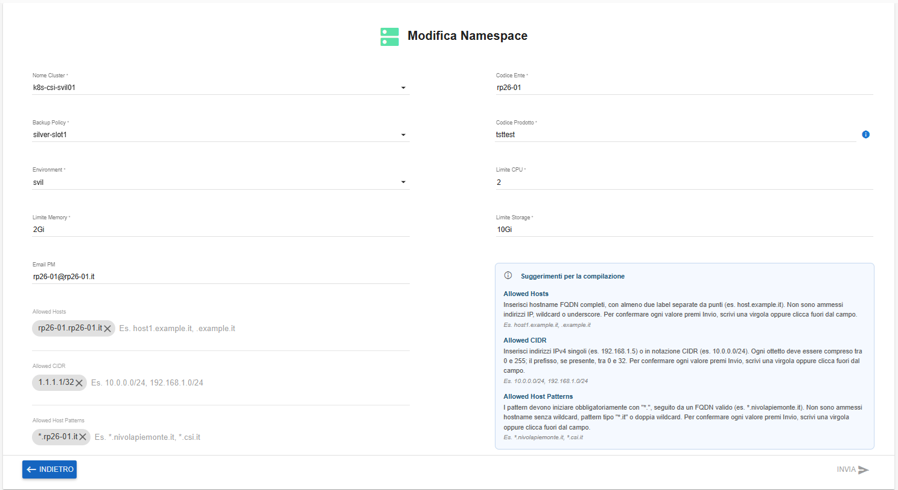

**Modificare Namespace (ECAAS)**
================================

Per modificare un Namespace (ECAAS) occorre selezionarne uno, quindi cliccare sull'icona in alto a destra "**Modifica Namespace**":

|

Si accederà alla pagina **Modifica Namespace**, da cui è possibile effettuare le modifiche richieste:

Alla prima modifica effettuata, il tasto **INVIA** diventerà cliccabile. Una volta terminate le modifiche, cliccare sul tasto in basso a destra **INVIA**.

|

Comparirà il seguente messaggio di conferma:

