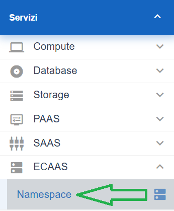

**Lavorare con i Namespace (ECaaS)**
************************************

La funzione rientra nel menù **Servizi**. Il servizio per la consultazione dei Namespace (ECaas) è attivabile dalla parte
sinistra dello schermo, cliccando sulla label **Namespace** sotto la label **ECAAS**.

.. toctree::
   :maxdepth: 2

   17.75.1_Elenco_Namespace.rst
   17.75.2_Elenco_Namespace_Dettaglio.rst
   17.75.3_Creazione_Namespace.rst
   17.75.5_Modifica_Namespace.rst
   17.75.4_Cancellazione_Namespace.rst
   
