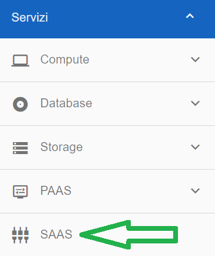

**Apertura ticket SaaS**
========================

La funzione è attivabile attraverso il ruolo **Master di account**.
Occorre accedere alla funzionalità **SAAS**, attivabile dalla parte sinistra dello schermo, all'interno del menù **Servizi** 

Dalla pagina **Elenco Saas attivi** cliccare sull'icona corrispondente alla colonna **Azioni**

.. image:: img/17.8.1_Azioni.png

Dalla schermata **Elenco Saas attivi** che appare, compilare i dati richiesti:

.. image:: img/17.8_ticketVuotoDX.png

Una volta compilati i campi richiesti, cliccare su **INVIA**

.. image:: img/17.8_ticketPienoDX.png

Comparirà il seguente messaggio a conferma della corretta apertura del ticket

