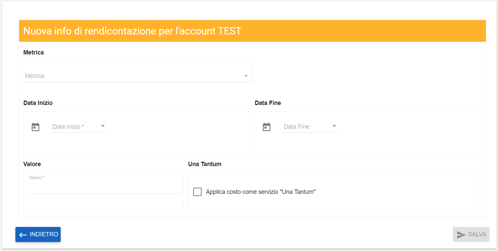
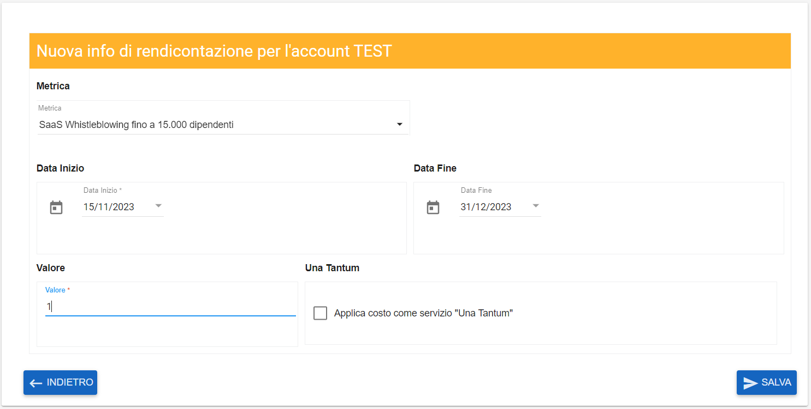

**SaaS**
========

I servizi disponibili col Saas sono:

**Servizio Moon**
*****************

Soluzione open source che costruisce moduli on line

**MOOn** è un servizio di modulistica cloud Open Source che consente di costruire moduli on line per digitalizzare le richieste presentate da cittadini e 
imprese alle pubbliche amministrazioni.

Con **MOOn** è possibile gestire l’iter di configurazione, pubblicazione e raccolta in formato digitale delle richieste, in modo trasversale rispetto alle 
tematiche trattate dagli enti pubblici (demografia, tributi, edilizia, servizi per il personale...).

|

**Servizio Whistleblowing**
***************************

Soluzione per la segnalazione spontanea e anonima di fatti o condotte ritenute illecite in ambito lavorativo.

**WhistleBlowing SaaS** è un servizio che permette di segnalare illeciti, irregolarità e misure ritorsive via web in conformità alle normative vigenti.

E’ disponibile in due opzioni, una per i comuni con meno di 15.000 dipendenti e una seconda per comune con più di 15.000 dipendenti.

|

**Attivazione**
***************

Le tre funzioni (Saas MOOn, WhistleBlowing SaaS oltre i 15000 dipendemti e WhistleBlowing SaaS fino a 15000 dipendenti) sono attivabili attraverso 
il ruolo **Amministratore di backoffice**. 
Occorre andare nella funzionalità di **Modifica di un account**, attivabile dalla parte sinistra dello schermo, cliccando sulla label **Accounts** 
sotto **Struttura organizzativa**.

.. image:: img/07.0_menuAccountsSX.png

Dalla pagina **Elenco Accounts**

.. image:: img/07.0_ElencoAccountsDX.png

Cercare e selezionare un account e quindi cliccare in alto a destra sul simbolo la cui descrizione passandoci sopra col mouse è "Modifica Elemento"

.. image:: img/Pulsante_modifica.png

Quindi spostarsi sul tab **SERVIZI DI GESTIONE ABILITATI**

.. image:: img/17.8_ServiziGA.png

Utilizzare il tasto "**+**" in alto a destra (la cui descrizione passandoci sopra col mouse è "Aggiungi una Nuova Info di rendicontazione")

.. image:: img/03_piu.png

Dalla schermata che si apre, compilare i dati richiesti:

Una volta compilati i campi popolando i dati presenti nelle combo box, cliccare su **SALVA**

La nuova metrica è ora presente nella pagina riassuntiva

.. image:: img/17.8_ServiziGAok.png

Utilizzare i tasti relativi al cestino 

.. image:: img/Pulsante_cancella.png

per cancellare la metrica

Utilizzare il tasto relativo alla matita

.. image:: img/03_modifica.png

per modificare la **Data Fine** della relativa metrica.
