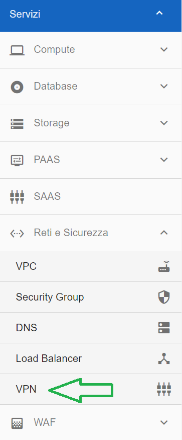
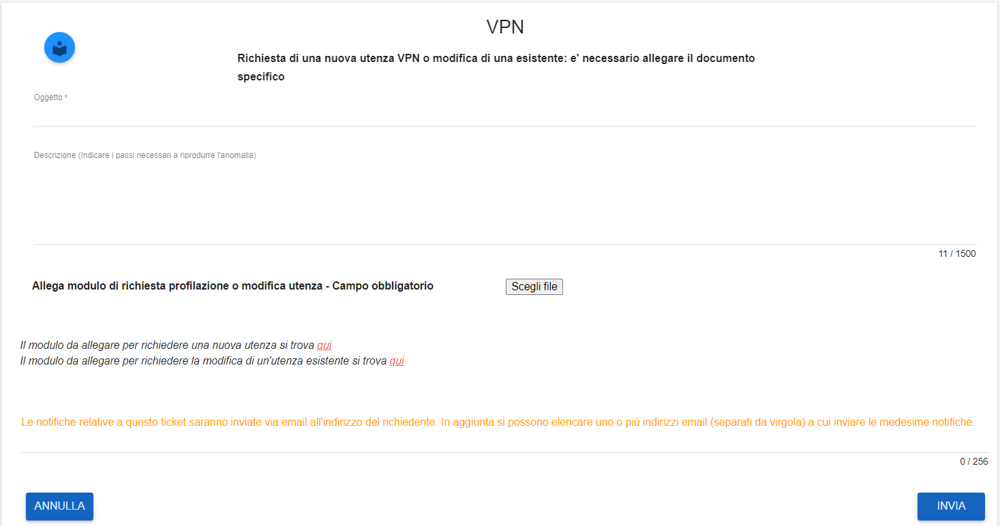
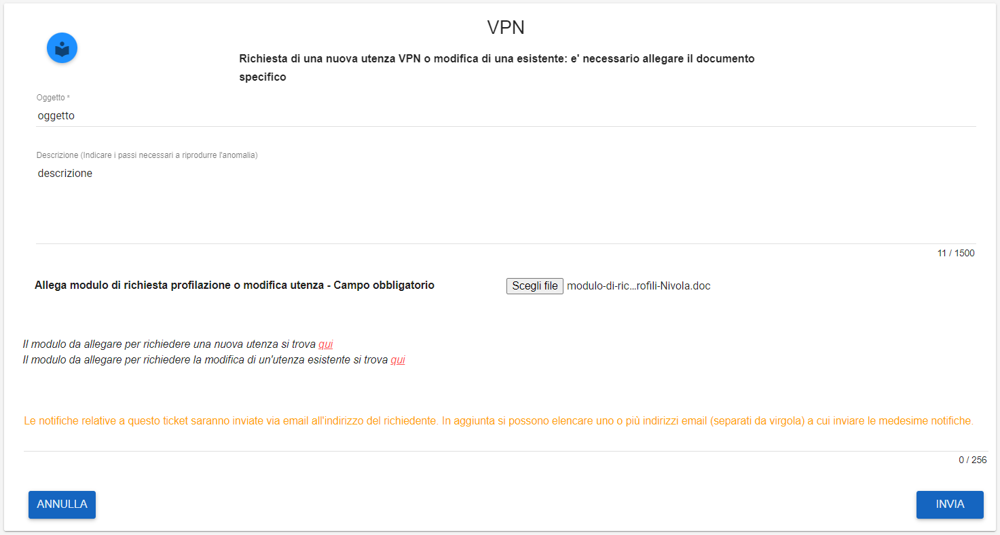

**Abilitazione Virtual Private Network (VPN)**
**********************************************

Gli ambienti creati su Nivola possono essere amministrati raggiungendo le VM tramite VPN, che possono essere abilitate dai referenti CSI 
utilizzando l’apposito processo previsto

La funzione è attivabile attraverso il ruolo **Master di account**.
Occorre accedere alla funzionalità **VPN**, attivabile dalla parte sinistra dello schermo, all'interno del menù **Reti e Sicurezza**

Dalla schermata **VPN** che appare, compilare i dati richiesti:

Una volta compilati i campi richiesti, cliccare su **INVIA**

Comparirà il seguente messaggio a conferma della corretta apertura del ticket

