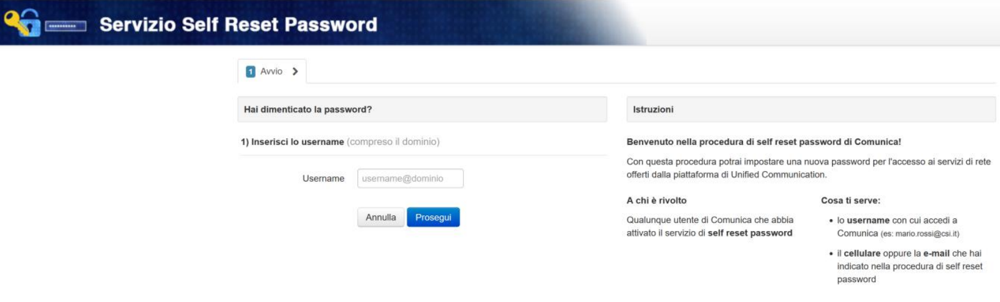
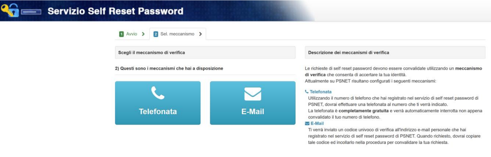
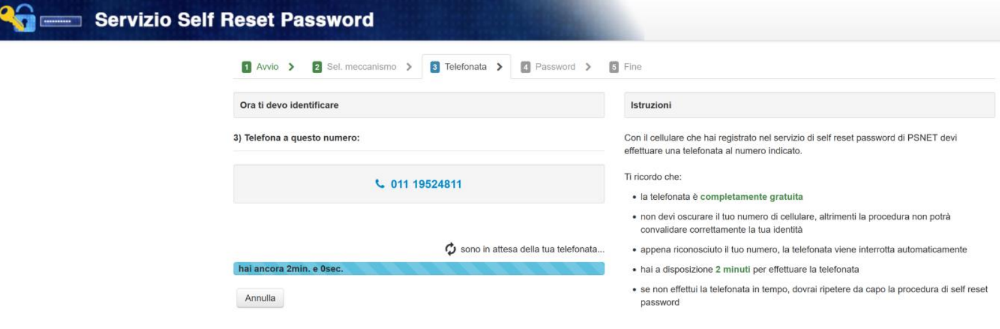
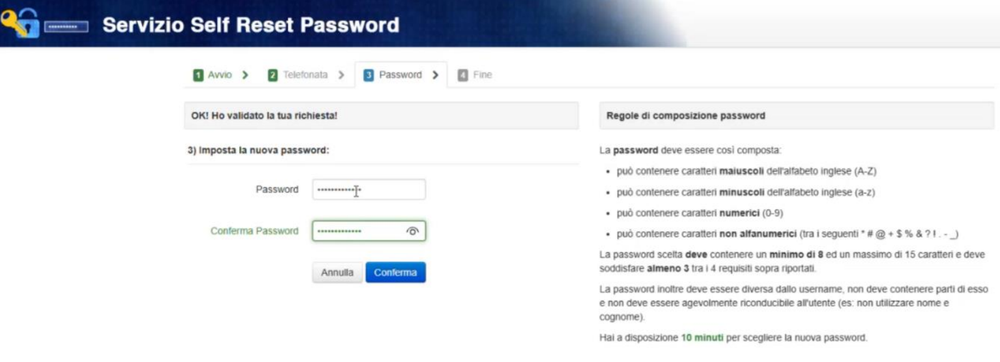

**Gestione Password Fornitori Esterni**
***************************************

Operazione specifica per i fornitori esterni che non sono organici all’organizzazione csi e che accedono ad un utenza nome.cognome@fornitori.nivola e che hanno la necessità di cambiare o creare la password.

|

:Servizio di Self Reset password:

Tale procedura è da utilizzare sia per il primo accesso sia per cambiare la password se scaduta oppure “persa” o “compromessa”; non è necessario ricordare la precedente password

• Collegarsi alla URL https://comunica.ruparpiemonte.it/cambia-password/index.html

• Inserire lo username del quale si vuole cambiare la password
    • nome.cognome@vpn.csi oppure
    • nome.cognome@fornitori.nivola
• Selezionare il pulsante Prosegui (in blu nell’immagine)
• Selezionare il meccanismo attraverso il quale resettare la password (telefonata o email)

• Nell’esempio della telefonata, occorre chiamare dal proprio telefono (utilizzato in fase di richiesta delle credenziali) il numero proposto

• Successivamente sarà possibile inserire una nuova password e confermarla

