**Lavorare con i TAG (master di account)**
##########################################

I Tags per Codice Prodotto fungono da riferimento per i progetti, e vengono assegnati agli account e alle risorse cloud istanziate nell’account.

Per assegnare i Tag per Codice Prodotto all'account e alle sue risorse, come VM, DBAAS, volumi e share, è necessario essere accreditati come Master di Account.

- l'Anagrafica Prodotti è consuntabile dal Portale e permette di avere una lista sempre aggiornata dei codici prodotto dei prodotti attivi e attuali

- la creazione di un tag codice prodotto per un account è possibile ricercando il codice prodotto di interesse tra quelli attuali e attivi

- tutti i tags relativi ad un codice prodotto per convenzione inizieranno con il prefisso “CP-”: digitando tale prefisso “CP-” l’interfaccia propone l’elenco dei tags codice prodotto disponibili per l’Account

- alla creazione di un tag codice prodotto l’utente potrà, se necessario, assegnare automaticamente il tag creato a tutte le risorse dell’Account di tipo VM, Volume, DBAAS, Share STAAS

- dopo la creazione del tag codice prodotto è possibile per il Master di Account assegnare (o revocare) un tag codice prodotto ad una risorsa (VM, DBAAS, Shares e Volumi) utilizzando l’interfaccia attuale

|

**Elenco codici prodotto per Account**
**************************************

Dopo aver effettuato il log-in sul Service Portal con il ruolo di Master di Account, si arriverà sulla Home Page del portale

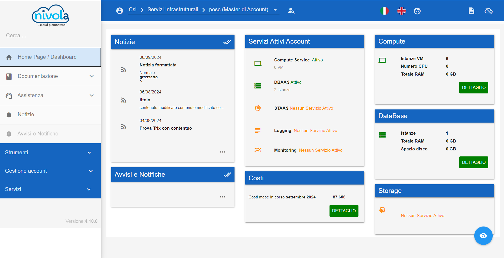

|

Se l’utente ha il ruolo di Master di Account, nel menù a sinistra, sotto la voce “Gestione Account” ci sarà la sottovoce “Anagrafica Prodotto”

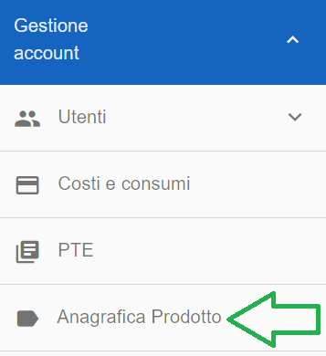

|

Andando su Anagrafica Prodotto verrà mostrata la lista dei codici prodotto che sono già associati all’account

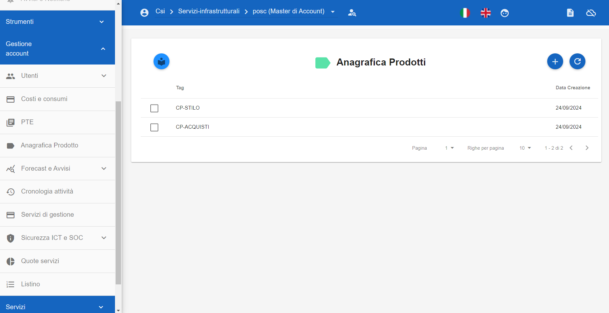

|

|

**Associazione codice prodotto ad un Account**
**********************************************

Se si desidera aggiungere un nuovo codice prodotto all’account, basterà cliccare sul tasto "**+**" (la cui descrizione è “Aggiungi nuovo Codice Prodotto”)
dalla schermata “Anagrafica Prodotti”

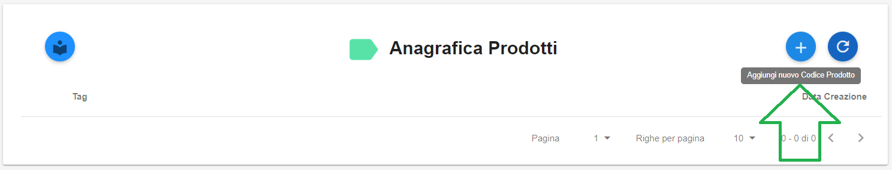

|

Cliccando su questo pulsante si arriverà nella seguente schermata

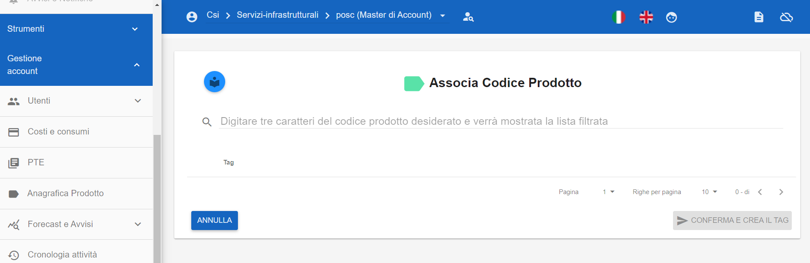

|

Digitando sulla barra di ricerca almeno tre lettere del codice prodotto che si desidera aggiungere, verrà mostrata la lista di tutti i codici che corrispondono alla 
ricerca

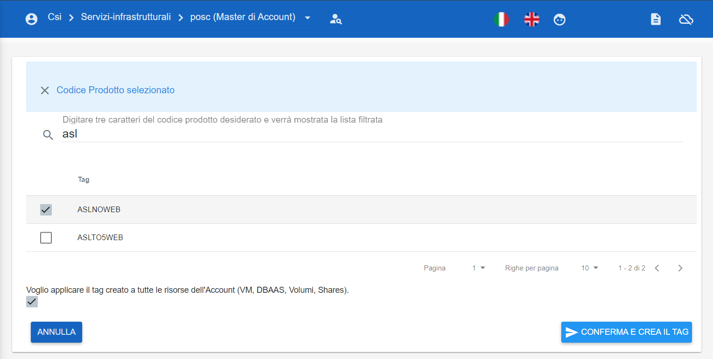

|

Dopo aver selezionato il codice prodotto da associare, sarà possibile scegliere se applicarlo automaticamente a tutte le risorse dell'account, come VM, DBAAS e volumi, 
oppure associarlo inizialmente solo all'account, con la possibilità, di assegnarlo  manualmente alle risorse specifiche in un momento successivo

Questa cosa sarà possibile deciderla tramite il flag in basso a sinistra

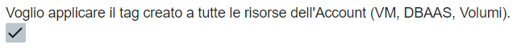

Per le Shares questo automatismo non è disponibile, i codici potranno essere assegnati manualmente come verrà spiegato di seguito.

Infine per confermare l’associazione bisognerà cliccare sul pulsante 

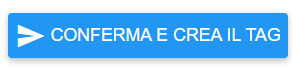

|

Una volta completata l’operazione verrà mostrato un messaggio di riuscita creazione e si tornerà alla lista dei codici prodotto aggiornata

|

|

**Eliminare Codice prodotto da un Account**
*******************************************

Se si desidera eliminare il codice prodotto precedentemente associato all’Account, basterà andare nella lista dei codici prodotto, selezionare 
quello che si vuole eliminare e cliccare sul pulsante a forma di Cestino (la cui descrizione è “Elimina Codice Prodotto Associato”)

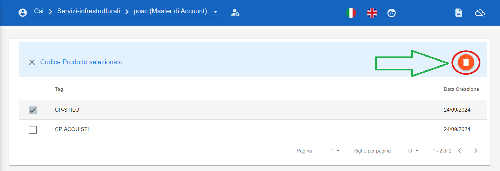

Prima dell’eliminazione effettiva verrà chiesto di confermare la scelta per evitare che vengano cancellati codici per errore.
Nel caso in cui si deciderà di eliminare un codice prodotto che è associato ad una o più risorse dell’account, il tag corrispondente al codice 
prodotto verrà rimosso anche da esse.

Dalla seguente schermata, cliccare su **CONFERMA**

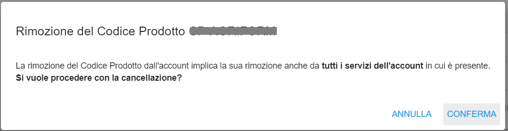

Comparirà il seguente messaggio di conferma finale

|

|

**Associazione codice prodotto ad una Risorsa specifica**
*********************************************************

Nel caso i cui si volesse associare un codice prodotto, precedentemente associato all’account, ad una risorsa specifica, bisognerà innanzitutto
raggiungere la risorsa desiderata

Se la risorsa desiderata dovesse essere una **VM**, la lista delle VM si trova sotto
“Servizi” --> “Compute” --> “VM”

Se la risorsa desiderata dovesse essere un **Volume**, la lista dei Volumi si trova sotto
“Servizi” --> “Compute” --> “Volumi”

.. image:: img/24.5_tag13.png

|

Se la risorsa desiderata dovesse essere un **DBAAS**, la lista dei DBAAS si trova sotto
“Servizi” --> “Database” --> “Istanze DBAAS”

.. image:: img/24.5_tag14.png

|

Se la risorsa desiderata dovesse essere una Share, la lista delle Shares si trova sotto
“Servizi” --> “Storage” --> “Shares”

.. image:: img/24.5_tag16.png

|

La voce VM, ad esempio, porterà alla lista di tutte le VM dell’account.
Per associare un codice ad una risorsa specifica, bisognerà selezionare la risorsa desiderata e cliccare sul pulsante “Pannello gestione VM”
(Ogni tipo di risorsa avrà il suo Pannello di gestione, in questo caso VM)

.. image:: img/24.5_tag15.png

|

Verrà quindi mostrata la schermata di gestione dove saranno presenti tutte le caratteristiche della risorsa, tra cui anche i Tags

.. image:: img/24.5_tag17.png

|

Per aggiungere un codice prodotto bisognerà digitare "**CP-**“ e verrà mostrata tutta la lista dei codici prodotto precedentemente associati all’account

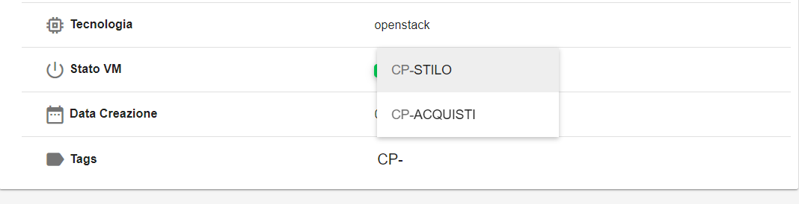

Basterà selezionare il codice che si desidera e verrà aggiunto

Nel caso in cui in fase di associazione del codice all’account fosse stato selezionato il flag che associa automaticamente il codice anche alle risorse, 
allora il codice verrà direttamente mostrato

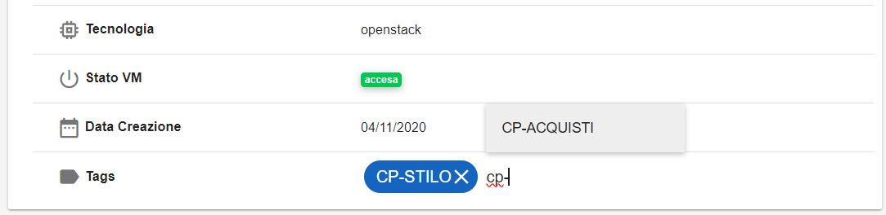

|

|

**Eliminare codice prodotto da una Risorsa specifica**
******************************************************

Se si desidera eliminare un codice prodotto da una risorsa specifica, basterà selezionare la risorsa, andare nel suo pannello di gestione e cliccare 
sulla **X** del codice da eliminare

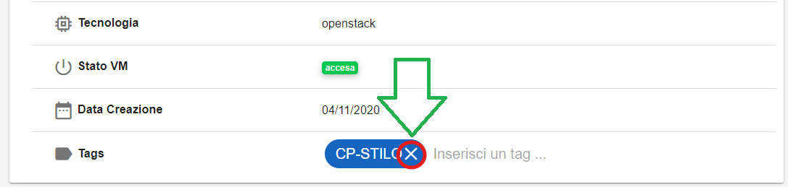

Comparirà il seguente messaggio di conferma finale

.. image:: img/24.5_tag21.png
