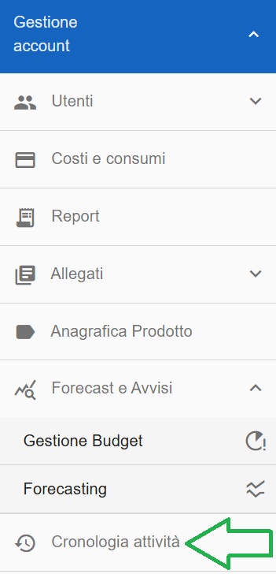
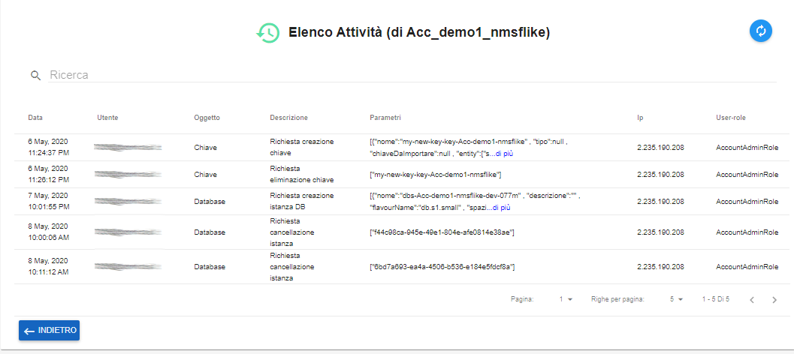

.. _Monitoraggio:

**Monitoraggio Attività**
*************************

E' possibile vedere l'elenco delle operazioni compiute sull'account
negli ultimi 30 giorni, utilizzando la funzione *Attività*.
Per attivarla sfruttare il pulsante sulla sinistra dello schermo:

La piattaforma esporrà, al centro dello schermo, l'elenco delle attività svolte
sull'account

Per ogni attività dell'elenco è riportata:

#. Data e Ora.
#. Utente che ha svolto l'operazione.
#. Oggetto cioè l'argomento della funzione (Database, Compute, Chiave, etc..)
#. Descrizione
#. Parametri usati
#. IP da quale macchina è stata svolta l'attività.
#. User-role il ruolo  ricoperto dall'utente.

Ciascuna delle informazioni può essere oggetto di ricerca all'interno della lista.

