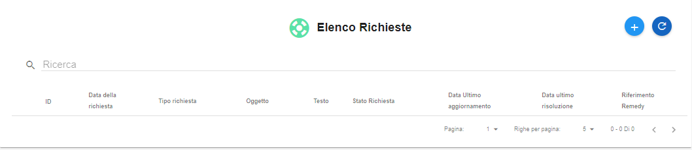
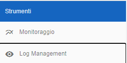
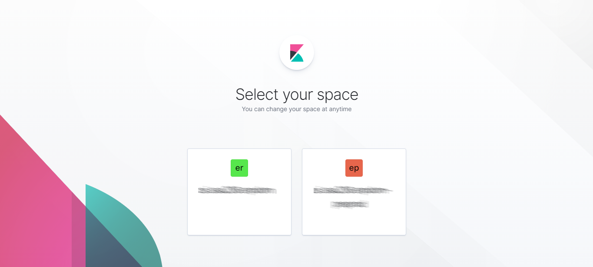
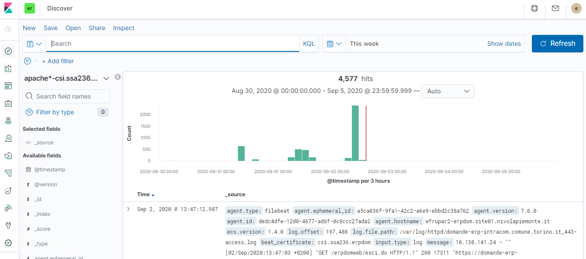

.. _Log:

**Log**
*******

E' possibile attivare il servizio di Log utilizzando la funzione **Richiesta supporto**.

.. image:: img/Richiesta_Assistenza.png

Dall'elenco richieste

Premere il pulsante **"+"**

.. image:: img/Add_VM.png

Compilare la form, specificando che si richiede il servizio di **Log** nel messaggio
e premere invia.

.. image:: img/Richiesta_email.png

Sulla base della richiesta, il supporto, vi contatterà per modellare insieme il servizio sulle specifiche necessità.
Il servizio sarà fruibile dal portale, attraverso la label **Log e management**
oppure utilizzando l'url: https://logwatch.site01.nivolapiemonte.it/login?next=%2F

Inserire **username** e **password** e premere **Log in**

.. image:: img/Kibana_Log.png

Selezionare l'oggetto tra quelli proposti dal sistema.

Procedere all'utilizzo della Dashboard di Kibana sulla base delle esigenze. A titolo di esempio
è possibile utilizzare il tasto **Discover**.

.. image:: img/Kibana_Discover.png

Per selezionare l'indice su cui impostare le ricerche e personalizzare i filtri secondo le proprie esigenze.

