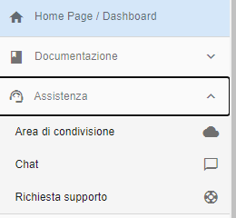
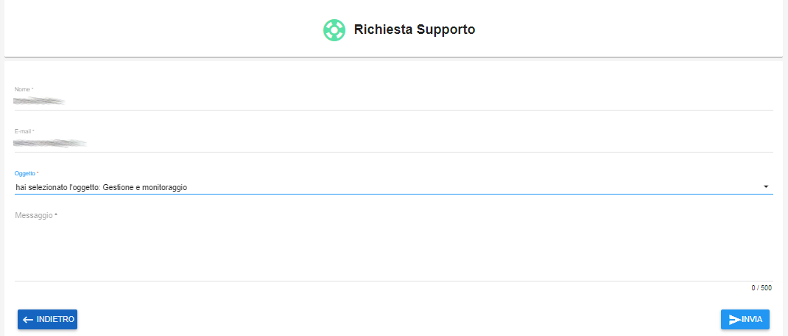

.. _Monitoraggio:

**Monitoraggio Risorse**
************************

E' possibile attivare il servizio di monitoraggio sull'infrastruttura istanziata utilizzando
la funzione **Richiesta supporto**.

Dall'elenco attraverso il pulsante **"+"** compilare
la richiesta specificando: **Account**, **VM** e **Cartella** nel messaggio
e premere invia.

Sulla base delle indicazioni ricevute, il supporto,
attiverà il **Monitoraggio** e avviserà il richiedente attraverso l'e-mail indicata.

Il servizio sarà fruibile dal portale, attraverso la label **Monitoraggio**
oppure utilizzando l'url https://syswatch.nivolapiemonte.it/?orgId=1

.. image:: img/Monitoraggio_Innesco.png

A seguito di un click sul pulsante, il sistema, metterà a disposizione la **Dashboard**
per la governance delle componenti, sulle quali è stato richiesto il **monitoraggio**.

.. image:: img/Monitoraggio_Dashboard.png

