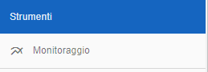
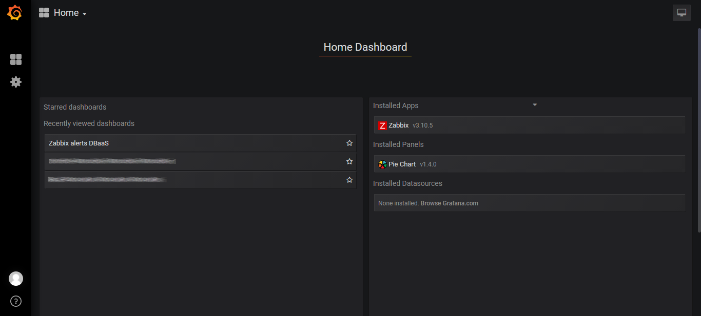

.. _Monitoraggio:

**Monitoraggio Risorse**
************************

E' possibile attivare il servizio di monitoraggio sull'infrastruttura istanziata inviando un e-mail a
nivola.supportcenter@csi.it specificando: **Account**, **VM** e **Cartella**.

Sulla base delle inidicazioni ricevute, il supporto,
attiverà il **Monitoraggio** e avviserà il richiedente attraverso un e-mail.

Il servizio sarà fruibile dal portale attraverso la label **Monitoraggio**

A seguito di un click sul pulsante, il sistema, metterà a disposizione la **Dashboard**
per la governance delle componenti sulle quali è stato richiesto il **monitoraggio**.

