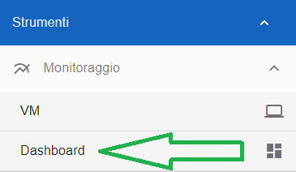
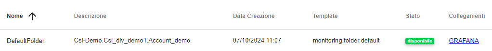
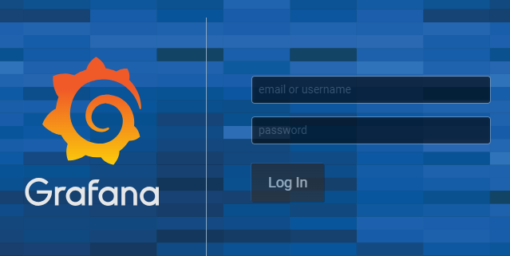
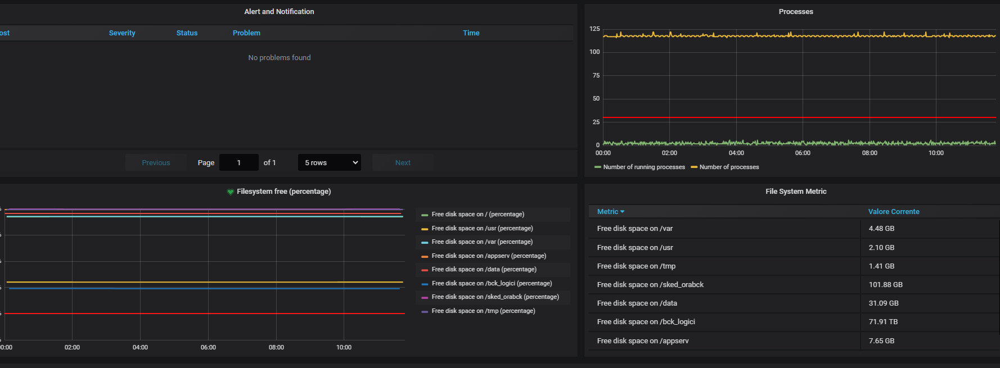

**Monitoraggio infrastrutturale Grafana**
*****************************************

**Caratteristiche del servizio**

Il servizio permette il monitoraggio delle componenti infrastrutturali dei servizi messi a disposizione dei clienti, la console di visualizzazione in uso è **Grafana**.

Grafana è una piattaforma open-source per la visualizzazione e il monitoraggio dei dati, comunemente utilizzata per analizzare e presentare metriche di sistema. 
Di seguito le principali caratteristiche relative alla modalità di erogazione del servizio:

•	È possibile la definizione di ruoli e utenze a seconda delle esigenze di accesso ai dati;
•	Accesso a determinate aree di lavoro in modo controllato e filtrato da apposite policy;

|

|

**Modalità di accesso**

La funzione rientra nel menù **Strumenti**. L’accesso è attivabile dalla parte sinistra dello schermo, cliccando sulla label **Dashboard**, sotto **Monitoraggio**

|

Dalla pagina **Dashboard**, cliccare sul link presente sotto il titolo «Collegamenti»

|

Il sistema aprirà una nuova finestra con l’accesso alla pagina di **Grafana**:

•	gli utenti CSI accedono con le utenze PSNET di Comunica
•	gli utenti esterni con l’utenza fornitori nivola

|

Selezionare quindi la consolle da visualizzare, una volta scelta la dashboard si viene indirizzati sulla pagina, dove sono presenti i monitoraggi ed è possibile visualizzare 
i campi di interesse:

