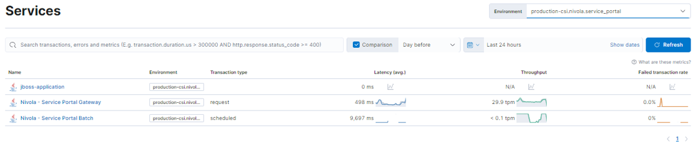
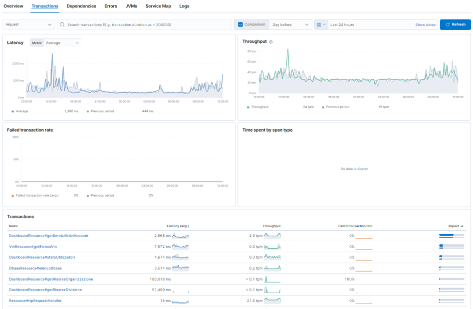

.. _30.5_Monitoraggio_applicativo_APM:

**Monitoraggio Applicativo APM**
********************************

**SERVICES**.
Dalla schermata principale del servizio APM, è possibile selezionare il servizio relativo all'applicazione in Services

**TRANSACTIONS**.
In Transactions si hanno informazioni e statistiche riguardanti tutte le transazioni effettuate dal servizio

**TRACE SAMPLE**
In Trace Sample è possibile osservare le operazioni che vengono eseguite in una singola transazione con i relativi tempi

.. image:: img/30.5_Trace_sample

**STACK TRACE**
Nello Stack Trace è possibile vedere lo stack applicativo coinvolto nell'esecuzione della singola operazione

.. image:: img/30.5_Stack_trace

**DEPENDENCIES**
In Dependencies è possibile osservare gli elementi esterni coinvolti durante le operazioni eseguite dall'applicativo (ad esempio db)

.. image:: img/30.5_Dependencies

**ERRORS**
In Errors vengono mostrati gli errori più recenti dell'applicativo con il numero di occorrenze e l'ultima occorrenza

.. image:: img/30.5_Errors

**METRICS**
In Metrics vengono mostrate le metriche delle macchine su cui gira l'applicativo

.. image:: img/30.5_Metrics

**SERVICE MAP**
In Service Map, partendo dalle transazioni eseguite viene costruita la service map dell'applicativo

.. image:: img/30.5_Service_map