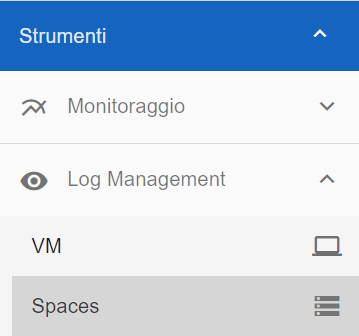

.. _30.7_Servizio_di_Log_Management:

**Servizio di Log Management**
******************************

**Caratteristiche del servizio**
================================

Il servizio permette la gestione dei log applicativi e di sistema delle istanze utente, attraverso
uno stack distribuito costituito da più moduli, accessibile attraverso un’applicazione front-end che funge da
interfaccia utente basato su suite ELK.
Viene messa a disposizione un’area di lavoro, accessibile attraverso un’applicazione front-end Web, che
permette la gestione, l’interrogazione e la visualizzazione degli indici e dei relativi dati.
È richiesta l’installazione di un agent sulle macchine client per l’invio dei log al sistema.

Di seguito le principali caratteristiche relative alla modalità di erogazione del servizio:

-  È possibile la definizione di ruoli e utenze a seconda delle esigenze di accesso ai dati;

-  Accesso a determinate aree di lavoro in modo controllato e filtrato da apposite policy;

-  Accesso e gestione degli indici a seconda del tipo di privilegi in possesso;

-  Cluster e servizio di Log Management completamente gestiti e amministrati.

Rientrano in queste competenze:

-  il backup dei dati;

-  il monitoraggio della disponibilità infrastrutturale;

-  l’aggiornamento tecnologico e di sicurezza della piattaforma

**Modalità di accesso**
=======================

La funzione rientra nel menù **Strumenti**. L'accesso è attivabile dalla parte
sinistra dello schermo, cliccando sulla label **Log Management** sotto **Strumenti**

A seguito di un clic su **Log Management**, il sistema aprirà una nuova finestra
con l'accesso alla pagina di **Elastic**:

.. image:: img/30.7_ElasticDx.png

work in progress - mancano schermate post accesso

