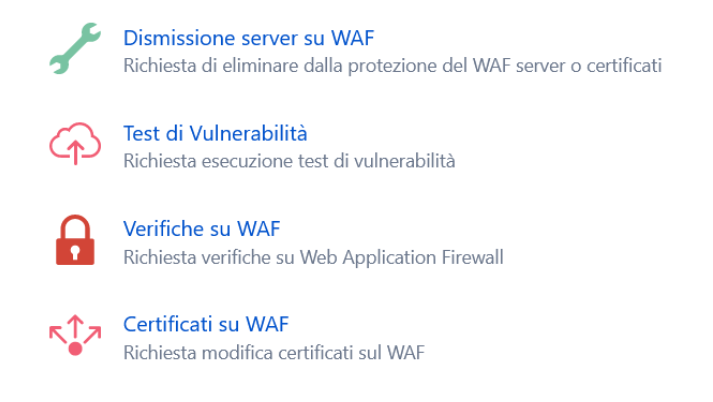

.. __Richiedere un Vulnerability Assestment:

**Richiedere un Vulnerability Assestment**
******************************************

Il CSI Piemonte eroga dei servizi classificabili come “Sicurezza ICT e SOC” (SOC : Security Operation Center).

Tra questi servizi vi è anche la possibilità di richiedere una sessione di Vulnerability Assesment.

A grandi linee l’intervento consiste in : 
Aggiungere una voce di menu “Sicurezza ICT e SOC” con una sottovoce “Test di vulnerabilità” (Vulnerability Assesment Test). 
Creare una form (vedi successiva descrizione di dettaglio) che deve essere compilata dal Master di account.
Il submit della form dovrebbe scatenare l’apertura di un ticket nascosto all’utente (non deve comparire nella lista dei tickets aperti dall’account) ma visibile al backoffice.

**work in progress**