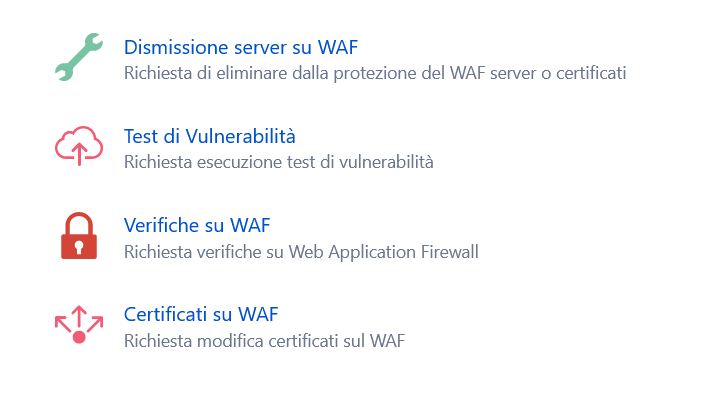

.. __Richiedere un Vulnerability Assestment:

**Richiedere un Vulnerability Assestment**
******************************************

Il CSI Piemonte eroga dei servizi classificabili come “Sicurezza ICT e SOC” (SOC : Security Operation Center).

.. image:: img/31.0_Servizi.png

Tra questi servizi vi è anche la possibilità di richiedere una sessione di Vulnerability Assesment.

A grandi linee l’intervento consiste in : 
Aggiungere una voce di menu “Sicurezza ICT e SOC” con una sottovoce “Test di vulnerabilità” (Vulnerability Assesment Test). 
Creare una form (vedi successiva descrizione di dettaglio) che deve essere compilata dal Master di account.

La funzione rientra nella **Gestione account**. La **Vulnerability Assessment Test** è utilizzabile dalla parte
sinistra dello schermo, cliccando sulla pulsante **Vulnerability Assessment Test** sotto la label **Sicurezza ICT e SOC**

   .. image:: img/31.0_VATsx.png

A destra comparirà il form "Test di Vulnerabilità"

Dopo aver inserito e controllato tutti i dati richiesti cliccare sul tasto in basso a destra **"INVIA RICHIESTA"**

Apparirà il seguente messaggio di conferma:

In automatico si riceverà sulla propria casella di posta elettronica una mail a conferma dell'avvenuta apertura del ticket:
(verificare con Luciano)

.. image:: img/100.35_Mail_da_Nuovo_Ticket.png

