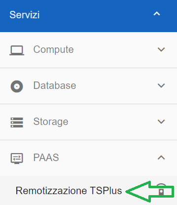
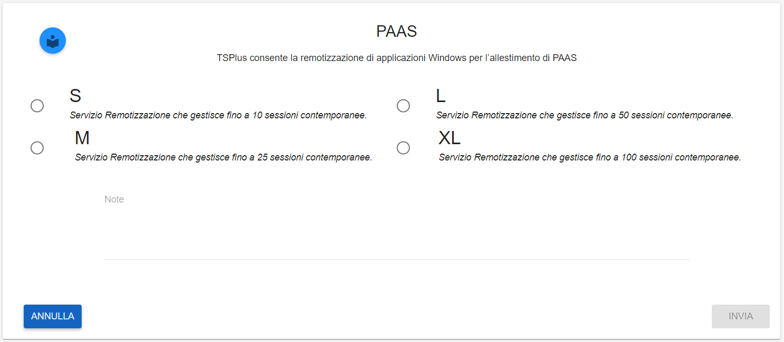
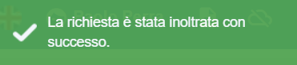

**Attivare servizio di Broker Applicativo e Desktop As a Service**
******************************************************************

**TS PLUS (master di account)**
===============================

TS Plus è un servizio che è possibile richiedere attraverso una remedy al Nivola Support Center.

Il servizio "PaaS Remotizzazione - Unmanaged"  prevede la messa a disposizione di piattaforme sw e/o ambienti remoti (Solution Stack) utilizzati per ospitare 
ed erogare servizi applicativi basati su architetture a due livelli (Client/server). Le PaaS di virtualizzazione prevedono architetture scalabili, il cui 
dimensionamento dipende dal numero di utenti contemporanei. L'architettura del servizio, al crescere degli utenti, può implementare servizi clustering e di 
load balancing, al fine di garantire un ottimale erogazione dei servizi applicativi ospitati.

Per maggiori informazioni si rimanda all'allegato tecnico di Nivola, mentre per attivare il servizio è necessario inoltrare la richiesta al Supporto attraverso 
i canali previsti. Il Nivola Support Center prenderà in carico la richiesta e provvederà a soddisfare questi passaggi:

1.	Creazione Server dedicato.
2.	Installazione TS Plus.
3.	Attivazione Chiavi.
4.	Avvisare Richiedente

|

:Attivazione:

La funzione è attivabile attraverso il ruolo **Master di account**.
Occorre accedere alla funzionalità **Remotizzazione TSPlus**, attivabile dalla parte sinistra dello schermo, all'interno del menù **PAAS**

Dalla schermata **PAAS - TSPlus consente la remotizzazione di applicazioni Windows per l’allestimento di PAAS** che appare, compilare i dati richiesti:

Una volta compilati i campi richiesti, cliccare su **INVIA**

.. image:: img/32.0_TsPlusDX2.png

Comparirà il seguente messaggio a conferma della corretta apertura del ticket

    