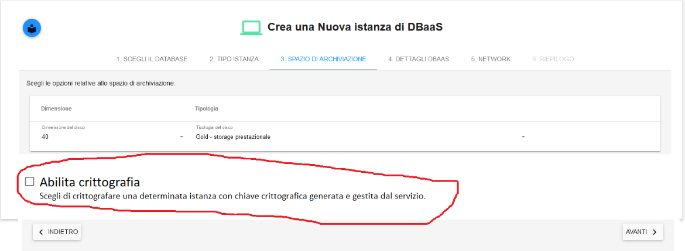

.. _attivare la cifratura dei dati:

**Attivare la cifratura dei dati**
**********************************

Descrizione
Ruolo : Master di Account
Navigazione : Servizi  🡪 DBAAS 🡪 Crea una nuova istanza DBAAS
Allo step 3 del wizard di creazione di una istanza DBAAS è necessario introdurre in qualche modo una richiesta per l’applicazione di crittografia all’istanza che si sta andando a creare.

Intervento
L’intervento al momento è poco più che l’aggiunta di una mockup che permetta tramite una checkbox di indicare la scelta di avere o meno la crittografia

**work in progress**
