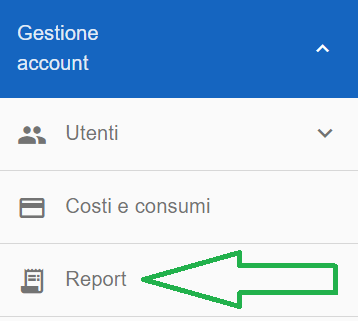
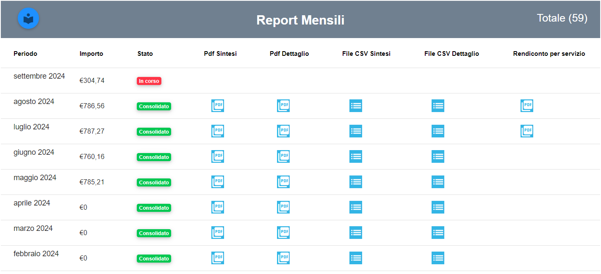
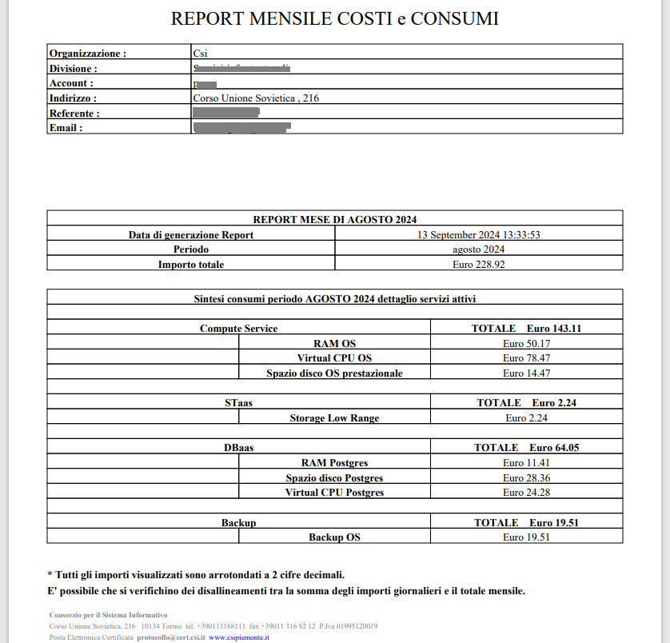
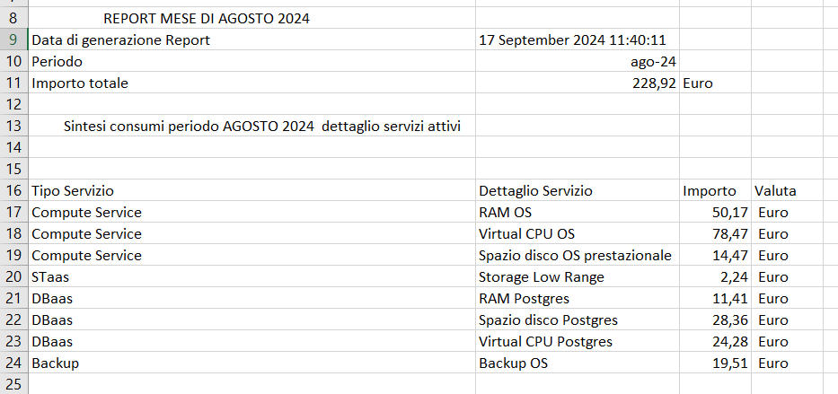
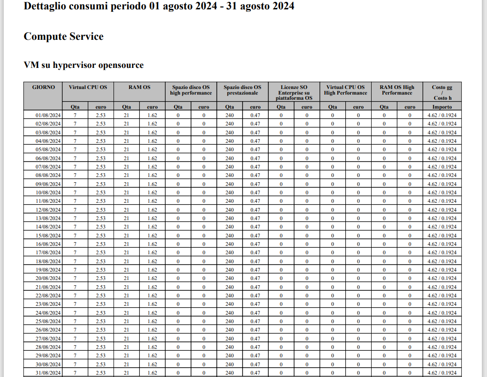
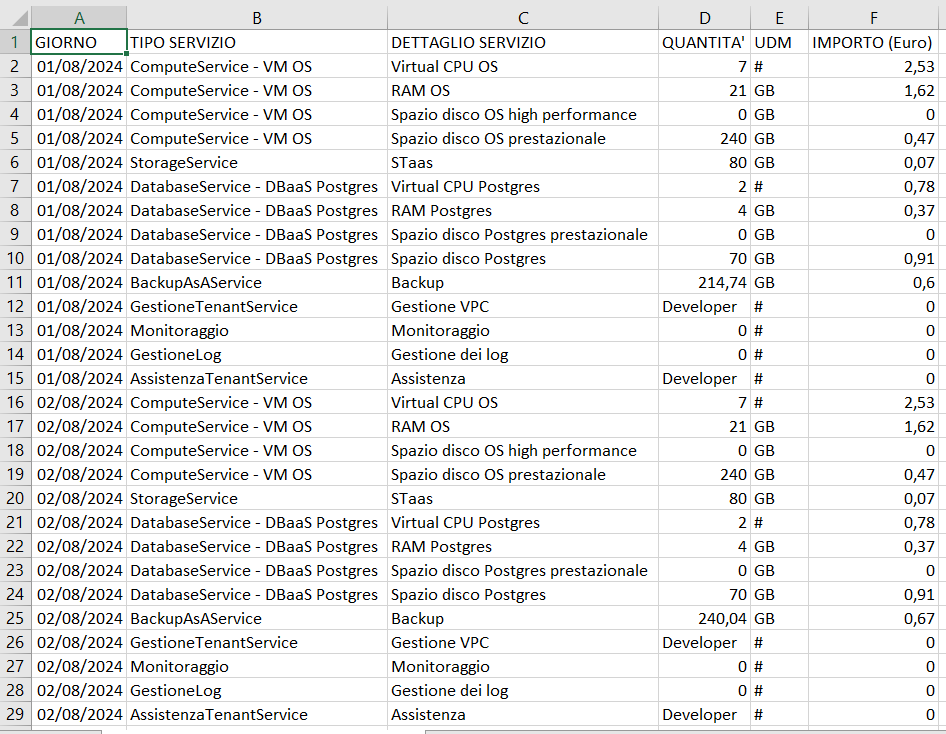
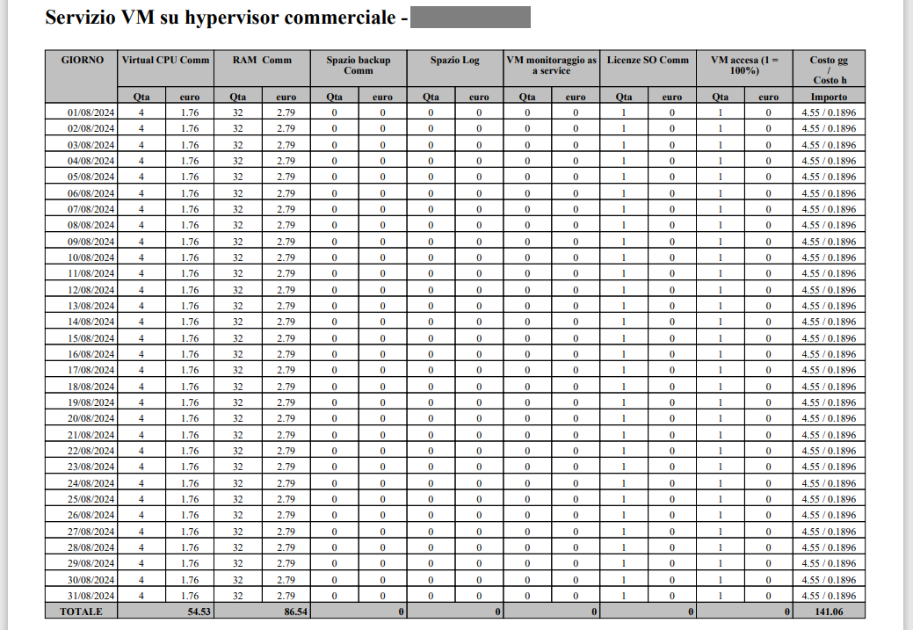
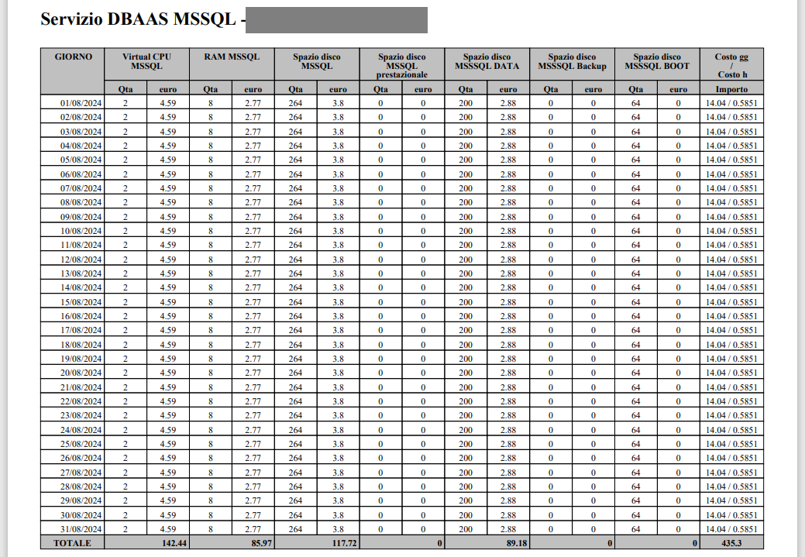
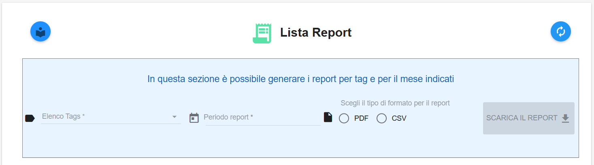

**Report**
**********

|

**Master di Account**

I **Report** sono visibili attraverso il menu posto alla
sinistra dello schermo. Cliccando sulla label **Report**
sotto la label **Gestione account**

|

A seguito del clic su **Report**, il sistema presenterà nella
parte destra del video il report dei consumi mensili nel formato **Pdf** e **CSV**, cliccando l'icona relativa

|

Il file **Pdf Sintesi** e il file **CSV Sintesi** riportano mensilmente i costi di ciascun servizio istanziato, riferito alla singola componente

|

Nei file **Pdf Dettaglio** e **File CSV Dettaglio** invece è indicato giornalmente il consumo dei servizi per ogni suo elemento

|

Quando presente, la colonna **Rendiconto per servizio** riporta il report mensile dei costi e consumi per **ISTANZA di SERVIZIO** (cioè per singola VM e DBAAS)

|

Quando presente, il tab in alto in azzurro **In questa sezione è possibile generare i report per tag e per il mese indicati** 
permette di filtrare i report, oltre che per periodo, anche per gli eventuali Tag che sono stati associati alle VM, Dbaas e Volumi

