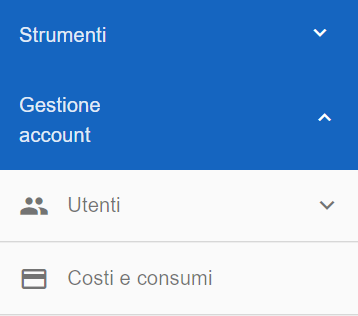
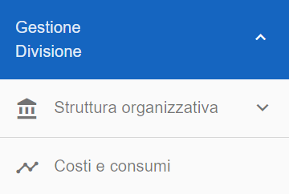
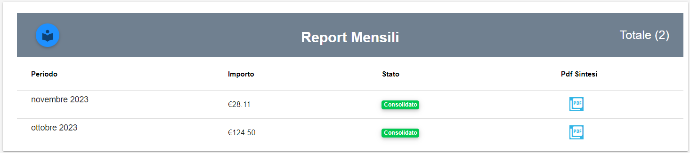

**Consultare costi e consumi (master di account e master di division)**
***********************************************************************

|

**Master di Account**

I **Costi e Consumi** sono visibili attraverso il menu posto alla
sinistra dello schermo. Cliccando sulla label **Costi Consumi**
sotto la label **Gestione account**

A seguito del clic su **Costi e Consumi**, il sistema presenterà nella
parte destra del video i **Costi non rendicontati**
e l'**Andamento dei Costi**.
Il grafico e la tabella, fanno riferimento al **Consumo** e al **Costo**
dei servizi acquistati e istanziati nell'account.

.. image:: img/CostiConsumi_Grafici.png

|

**Master di Division**

I **Costi e Consumi** sono visibili attraverso il menu posto alla
sinistra dello schermo. Cliccando sulla label **Costi Consumi**
sotto la label **Gestione Divisione**

A seguito del clic su **Costi e Consumi**, il sistema presenterà nella
parte destra del video i **Costi non rendicontati**, l'**Andamento dei Costi** e i **Costi suddivisi per account**.
Il grafico e la tabella, fanno riferimento al **Consumo** e al **Costo** dei servizi acquistati e istanziati nella division.

.. image:: img/CostiConsumi_Grafici.png

E' possibile scaricare il report dei consumi mensili nel formato  **Pdf** cliccando l'icona relativa.
Il **Pdf Sintesi** riporta mensilmente i costi di ciascun servizio istanziato, riferito alla singola componente. 

