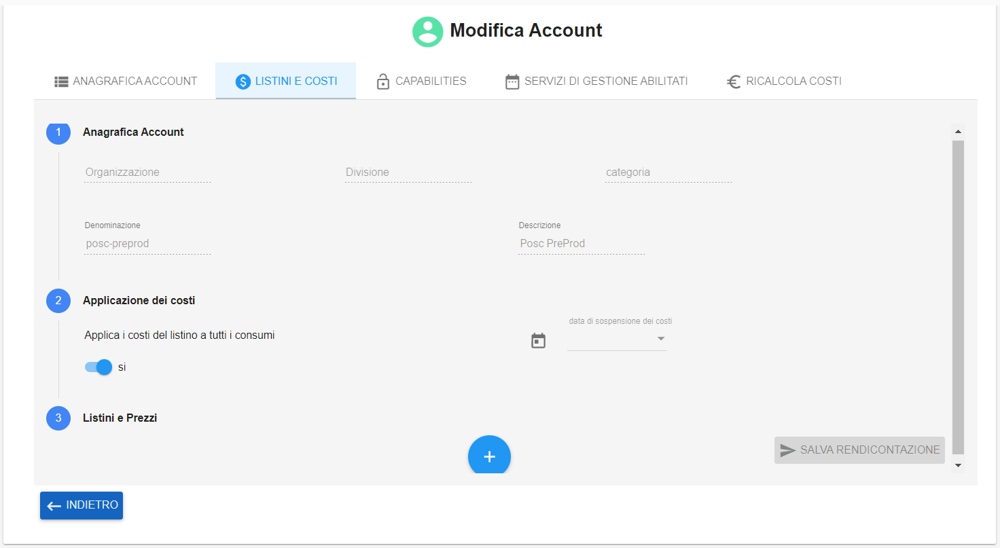
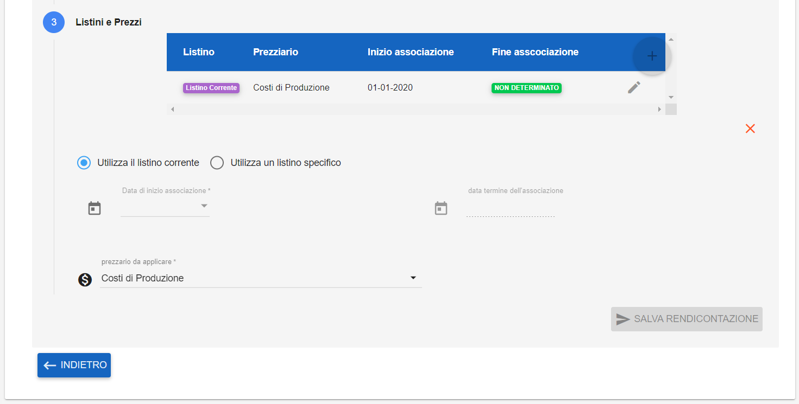

.. _Associazione_Listino_Account:

**Associazione di un listino ad un account**
******************************

La gestione dei **LISTINI E COSTI** è attivabile dalla voce servizio **Accounts** posto nella parte sinistra dello schermo, sotto la label **Struttura organizzativa**. 
Cliccando sulla freccia a destra della voce, apparirà **Accounts** e a seguito di un clic il sistema popolerà la parte centrale del video con l”Elenco degli accounts.

.. image:: img/42.0_Elenco_Accounts.png

1. **Selezionare** l'account

.. image:: img/42.0_Account_selezionato.png

2. Usare il bottone **Modifica Elemento**;

.. image:: img/Pulsante_modifica.png

3. Selezionare la voce **LISTINI E COSTI**:
 

4. Premere il tasto "+" sotto **Listini e prezzi**:

.. image:: img/Add_VM.png

5. Decidere se utilizzare il **listino corrente** oppure un **listino specifico**.
Sfruttando le combo box proposte inserire: data di inizio associazione, data termine dell'associazione, prezzario da applicare;

**Data inizio contabilizzazione costi**: 
E’ la data a partire dalla quale i consumi rilevati per l’Account devono essere contabilizzati, ovvero devono essere calcolati i costi. Può non essere valorizzata
(in questo caso tutti i consumi verranno contabilizzati), anche se è raccomandabile che lo sia. Può essere nel passato o nel futuro. 
Può essere modificata e/o rimessa a null.

**Data fine/sospensione contabilizzazione costi**: 
rappresenta la data successivamente alla quale i consumi non verranno più contabilizzati. Può essere nel passato o nel futuro. 
Può essere modificata e/o rimessa al valore nullo.

**Associazione Account/Listino**: 
La valorizzazione dei consumi in costi richiede determinare quali tariffe debbano essere applicate ai consumi per ottenere il costo corrispondente. 
Ogni Listino si contraddistingue per delle proprietà:
Periodo di applicabilità (data inizio validità, data fine validità);
Tipologia : CSI, Specifico;
Voci di Listino : Ogni voce di Listino è associata ad un servizio CSI, oppure ad una metrica di un servizio, a dei servizi di gestione/assistenza o 
altre tipologie di servizi presenti nel Listino Servizi Nivola che il CSI rinnova normalmente ogni anno solare. Ogni voce di Listino viene valorizzata 
con uno o più importi a seconda della “tipologia prezzo” da applicare allo specifico Account.

6. Controllare i dati inseriti e salvarli premendo sul pulsante **SALVA RENDICONTAZIONE****

