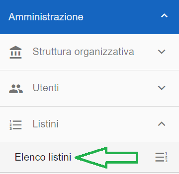
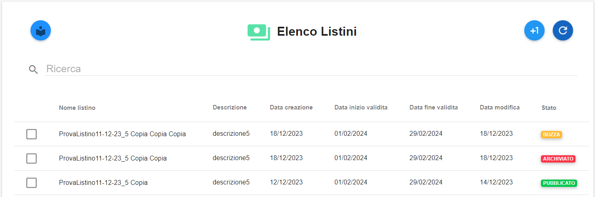
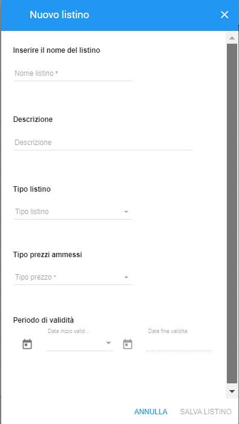
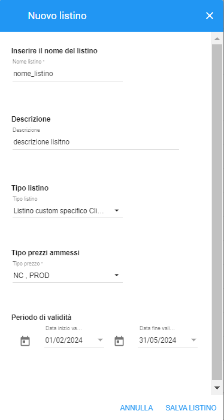
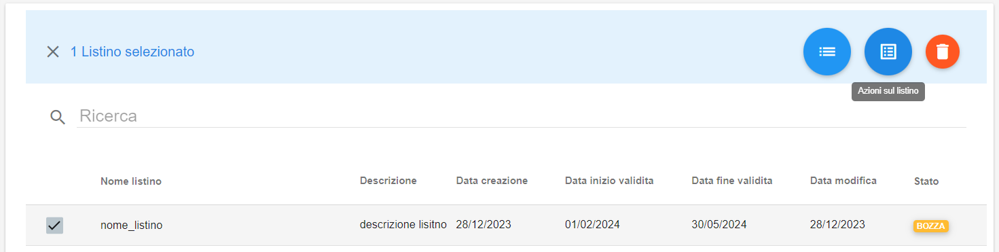
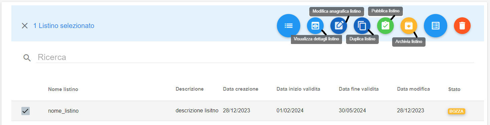
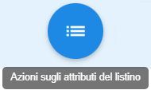
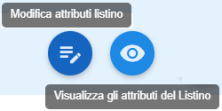
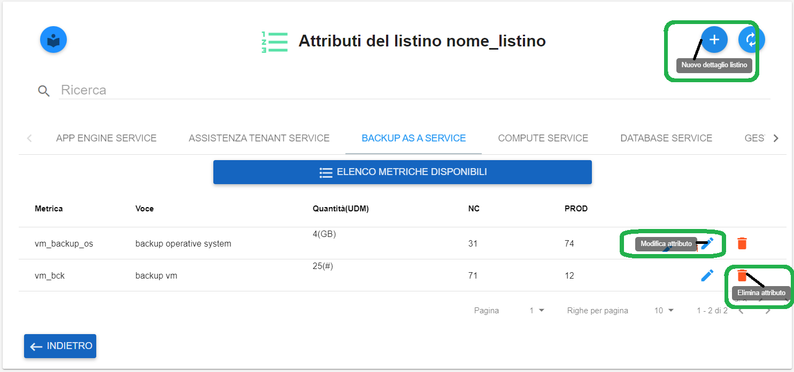

**Registrazione e Modifica Listini (amministratore di backoffice)**
*******************************************************************

La registrazione di nuovi listini e la modifica dei listini esistenti è attivabile attraverso il ruolo **Amministratore di Backoffice**.

Occorre accedere alla funzionalità **Elenco listini** attivabile dalla parte  sinistra dello schermo, sotto la label **Listini**

Dalla schermata **Elenco Listini** è possibile visionare la lista dei listini attualmente esistenti:

|

**Creazione nuovo listino**
***************************

Cliccare sul tasto in altro a destra "**+1**", la cui descrizione passandoci sopra col mouse è **Registra nuovo listino**

Dalla finestra  **Nuovo listino** che appare, compilare i dati richiesti:

Una volta compilati i campi richiesti, cliccare su **SALVA LISTINO**

Comparirà il seguente messaggio a conferma della corretta creazione del listino

.. image:: img/42.5_ListinoCreatoDXok.png

|

**Modifica listino**
********************

Selezionare un listino e cliccare sul tasto blu in altro a destra, la cui descrizione passandoci sopra col mouse è **Azioni sul listino**

Compariranno i relativi sotto-pulsanti che permettono di effettuare le operazioni riportate nelle relative descrizioni sottostanti

**Archivia listino** -> cambia lo stato corrente di un listino in "ARCHIVIATO"

**Pubblica listino** -> cambia lo stato corrente di un listino in "PUBBLICATO"

**Duplica listino** -> permette di duplicare il listino selezionato, nell'ottica di modificarlo per crearne uno nuovo

**Modifica anagrafica listino** -> permette di modificare i dati anagrafici del listino selezionato

**Visualizza dettagli listino** -> permette di visualizare i dati anagrafici del listino selezionato

|

**Attributi listino**
*********************

Selezionare un listino e cliccare sul tasto blu in altro a destra, la cui descrizione passandoci sopra col mouse è **Azioni sugli attributi del listino**

Compariranno i relativi sotto-pulsanti che permettono di effettuare le operazioni riportate nelle relative descrizioni sottostanti

|

**Visualizza gli attributi del listino**

Permette di visualizzare le metriche associate al listino, le quali appaiono in diversi tab e suddivise per tipologia

.. image:: img/42.5_azioniListinoAttrVisualizza.png

**Modifica attributi listino**

Permette di modificare le metriche associate al listino, suddivise per tipologia

